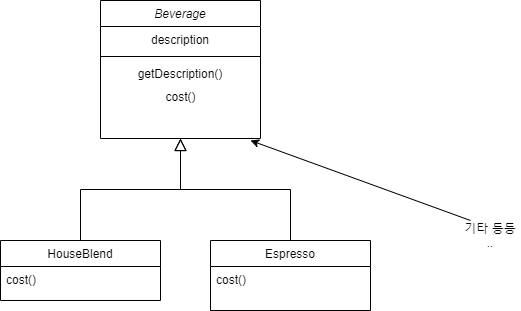
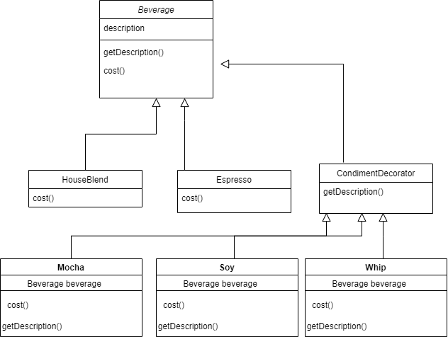

# Decorator Pattern

## 스타버즈 커피 초기 판매 시스템



처음에는 위 그림 처럼 스타버즈에서 기본 음료들만 판매 했습니다. 

하지만 손님이 많아 질수록 기존 레시피에서 휘핑 추가, 모카 추가 등 요구 하는 사람들이 많아 졌습니다.


그래서 처음에는 위 그림처럼 만들었습니다. 하지만 한눈에 딱 봐도 클래수 개수는 말도 안되게 많고 유지보수도 엄청 힘들어 질것 같습니다.

그래서 Beverage 클래스에 boolean 타입의 변수를 이용해 해당 재료를 첨가하는 방법을 선택 합니다.

```java
public class Beverage {
	// 여러가지 변수 선언
	public float cost () {
			float total = 0;
      if(hasMilk()) total+=500;
      if(hasShot()) total+=400;
      if(hasCream()) total+=300;
      if(hasJavachip()) total += 700;
      
      return total;
	}
}
```

```java
public class Espresso extends Beverage {

		@Override
    public int cost() {
        return 5000+super.cost();
    }
    
}
```

이렇게 구성 하였을때 편리 해 보일수 있지만 문제점이 있습니다

- 첨가물 가격이 바뀔 때마다 기존 코드를 수정 해야하는 문제
- 첨가물의 종류가 많아지면 새로운 메소드를 추가 하고 슈퍼클래스의 cost() 메소드도 수정 해야 하는 문제
- Beverage 클래서의 정의가 불분명 해지는 문제
- 손님이 샷이나 휘핑 크림 등을 두번 넣을 수 없는 문제

### 디자인 원칙

OCP(Open-Closed Principle): 클래스는 확장에 대해서는 열려 있어야 하지만 코드 변경에는 닫혀 있어야 한다.

기존 코드는 건드리지 않고 확장을 통해서 새로운 행동을 간단하게 추가 할 수 있도록 해야한다.

위의 원칙으로 만든 패턴중에 하나가 **데코레이션 패턴** 이다.

---

## 데코레이션 패턴

데코레이터 패턴은 주어진 상황 및 용도에 따라 어떤 객체에 책임을 덧붙이는 패턴으로 객체에 추가적인 요건을 동적으로 첨가한다. 데코레이터는 서브클래스를 만드는 것을 통해서 기능을 유연하게 확장할 수 있는 방법을 제공한다.

데코레이션 패턴 바탕으로 만든 설계 이미지이다.



```java
/*
가장 상위 슈퍼 클래스인 Beverage 클래스 
음료의 공통적인 성질을 따로 뺀 것으로 
모든 음료는 이 클래스에서 상속 받아야 한다.
*/
public abstract class Beverage {
    String description = "제목 없음"; // 음료 이름

    public String getDescription() {
        return description;
    }

    public abstract double cost();
}

/*
모든 첨가물들이 상속 받아야 하는 클래스 입니다.
*/
abstract class CondimentDecorator extends Beverage {
    public abstract String getDescription();
}

class Espresso extends Beverage {

    public Espresso() {
        description = "에스프레소";
    }

    @Override
    public double cost() {
        return 1.99;
    }
}

class HouseBlend extends Beverage {

    public HouseBlend() {
        description = "하우스 블렌드 커피";
    }

    @Override
    public double cost() {
        return 0.89;
    }
}

class Mocha extends CondimentDecorator {

    Beverage beverage;

    public Mocha(Beverage beverage) {
        this.beverage = beverage;
    }

    @Override
    public double cost() {
        return 0.20 + beverage.cost();
    }

    @Override
    public String getDescription() {
        return beverage.getDescription() + ", 모카";
    }
}

class Whip extends CondimentDecorator {
    Beverage beverage;

    public Whip(Beverage beverage) {
        this.beverage = beverage;
    }

    @Override
    public double cost() {
        return 0.10 + beverage.cost();
    }

    @Override
    public String getDescription() {
        return beverage.getDescription() + ", 휘핑크림";
    }
}

class Soy extends CondimentDecorator {

    Beverage beverage;

    public Soy(Beverage beverage) {
        this.beverage = beverage;
    }

    @Override
    public double cost() {
        return 0.15 + beverage.cost();
    }

    @Override
    public String getDescription() {
        return beverage.getDescription() + ", 두유";
    }
}

class StarBuzzCoffee {
    public static void main(String[] args) {
        Beverage beverage = new Espresso();
        System.out.println(beverage.getDescription() + "$" + beverage.cost());

        Beverage beverage1 = new HouseBlend();
        beverage1 = new Mocha(beverage1);
        beverage1 = new Whip(beverage1);
        beverage1 = new Soy(beverage1);
        System.out.println(beverage1.getDescription() + " $" + beverage1.cost());

    }
}

/**
실행결과 

에스프레소$1.99
하우스 블렌드 커피, 모카, 휘핑크림, 두유 $1.34
**/
```

위 데코레이터 패턴은 자바 I/O 클래스에서도 이 패턴으로 설계 되어 있습니다


### 데코레이터 패턴 단점

데코레이터 패턴도 단점이 있는데 

- 필요한 기능들을 추가하다 보면 잡다한 클래스가 너무 많다.
- 데코레이터 패턴 기반으로 작성된 API를 사용하여 개발해야 하는 사람 입장에서는 참 괴롭다
    - 처음 Java InputStream API를 접했을때 생각해보자
- 데코레이터를 도입하면 구성 요소를 초기화 하는데 필요한 코드가 훨씬 복잡해 진다