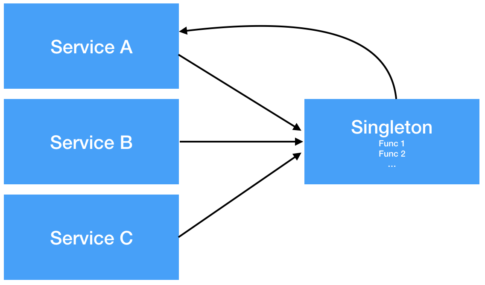

# Singleton Pattern

# Singleton Pattern 이란?

<aside>
🔥 싱글톤 패턴은 해당 클래스의 인스턴스가 하나만 만들어지고, 어디서든지 그 인스턴스에 접근할 수 있도록 하기 위한 패턴이다

</aside>


## 고전적인 싱글톤 패턴

```java
public class Singleton {
	private static Singleton uniqueInstance;
// 기타 인스턴스 변수
	private Singleton(){}

	public static Singleton getInstance() {
		if(uniqueInstance == null) {
			uniqueInstance = new Singleton();
		}
		return uniqueInstance;
	}
// 기타 메소드
}
```

싱글톤 패턴 구현하기 위해서 일반적으로 private 생성자를 가진 public 클래스를 사용한다

클래스는 인스턴스를 절대 생성 할수 없으므로 외부에서 생성하는 것이 아닌 인스턴스를 요청하도록 설계해야 한다 이 때 사용되는 getInstance() 같은 메소드는 정적메소드(static method)여야 한다.

(정적 메소드의 경우에 외부에서 클래스이름, 메소드이름으로 호출 될수 있기 때문)

## 고전적인 싱글톤의 문제점

위 같은 싱글톤은 문제가 있는데 여러개의 스레드가 이 싱글톤 인스턴스를 사용할려고 할 때 

if 문에 여러개의 스레드가 동시에 들어가서 인스턴스가 여러개가 만들어질 수 있는 문제가 생길수 있는 것이다.

근본적인 해결법으로는 여러개의 스레드가 같은 코드에 접근 하지 않게 하는 방법이 있다. 하지만 동기화를 시키지 않고도 해결 하는 방법도 있고

## GetInstance() 메소드 동기화(Synchronized)

getInstance() 메소드를 동기화 시키는 방법이다 (synchronized 키워드를 사용)

이렇게 하면 여러개의 스레드가 동시에 getInstance()를 사용 할수 없다 스레드 하나가 끝나면 다음 스레드가 시작 된다

```java
public class Singleton {
	private static Singleton uniqueInstance;
// 기타 인스턴스 변수
	private Singleton(){}

	public static synchronized Singleton getInstance() {
		if(uniqueInstance == null) {
			uniqueInstance = new Singleton();
		}
		return uniqueInstance;
	}
// 기타 메소드
}
```

하지만 문제점이 있다 

싱글톤은 만들고자 하는 인스턴스를 최초로 생성하는 순간에만 locking이 되면 되는데, 해당 방법으로는 생성 시도가 있을때마다 locking을 하게 되므로,  속도 성능 이슈가 있을수 있다.

## DCL(Double-Checking Locking) 사용

```java
public class Singleton {
	private volatile static Singleton uniqueInstance;
// 기타 인스턴스 변수
	private Singleton(){}

	public static synchronized Singleton getInstance() {
		if(uniqueInstance == null) {
			synchronized (Singleton.class){
				if(uniqueInstance == null {
					uniqueInstance = new Singleton();
				}
			}
		}
		return uniqueInstance;
	}
// 기타 메소드
}
```

getInstance 안에 두개의 if으로 더블 체킹 하는 방식이다

여기서 volatile은 

- volatile 변수는 CPU의 Cache를 거치지 않고 메인 메모리에 직접 read/write를 수행
- volatile 변수에 대한 접근(read/write)은 synchronized를 사용하는 것과 동일하게 동작
- primitive 타입과 object 타입(null 허용) 모두 사용 가능하다

하지만 책에서 나오지 않는 단점이 존재 하는데 먼저 volatile 변수의 단점 및 한계를 알아보면

 - 접근 성능이 느림 (캐시 사용 안하므로)

 - 단지 변수의 접근(read/write)에 대해서만 정합성 보장

출처: [https://bestugi.tistory.com/19](https://bestugi.tistory.com/19)

이 있다.  volatile을 씀으로 해서, 성능 문제가 생길수 있다.

## 책에는 없는 추가적것들

### LazyHolder 기법

```java
public class Singleton { 

		private Singleton(){} 

		public static Singleton getInstance() {
			 return LazyHolder.INSTANCE;
		}

		private static class LazyHolder {
			 private static final Singleton INSTANCE = new Singleton();
		}
}

```

이 방법은 static영역에 초기화를 하지만 객체가 필요한시점까지 초기화를 미루는 방식이다.

LazyHolder 클래스의 변수가 없기 때문에 Singleton 클래스 로딩 시 LazyHolder 클래스를 초기화하지 않는다.

 Singleton 클래스의 getInstance() 메서드에서 LazyHolder.INSTANCE를 참조하는 순간 Class가 로딩되며 초기화가 진행된다. 

Class를 로딩하고 초기화하는 시점은 thread-safe를 보장하기 때문에 volatile이나 synchronized 같은 키워드가 없어도 thread-safe 하면서 성능도 보장하는 아주 훌륭한 방법이다.

출처: [https://javaplant.tistory.com/21](https://javaplant.tistory.com/21)

### Singleton 주의점

- 상태를 가진 객체를 Singleton 으로 만들면 안된다.
    - 앱 내의 단 한개의 인스턴스가 존재하고, 이를 전역에서 접근할 수 있다면 각기 다른 스레드에서 객체의 상태를 마구잡이로 변경시킬 수 있기 때문이다. 상태가 공유된다는 것은 매우 위험한 일이기 때문에 무상태 객체 혹은 설계상 유일해야하는 시스템 컴포넌트를 Singleton으로 만들어야 한다
- 싱글톤은 SOLID 원칙을 위반할 가능성이 있다
    - Singleton을 사용하는 경우 대부분 인터페이스가 아닌 구현 클래스의 객체를 미리 생성해놓고 정적 메소드를 이용하여 구현하게 된다. 이는 SOLID 원칙을 위반할 수 있는 가능성이 있으며, 동시에 Singleton을 사용하는 곳과 Singleton Class 사이에 의존성이 생기게 됩니다. 이는 결합도를 높이는 행위로, 수정 및 단위테스트의 어려움이 생긴다.
- 리팩토링에서의 영향도는 프로그램 전체가 된다.
    
    
    
    - `Service A` 를 위해 만들어졌던 `Func 1` 을 다른 서비스들이 사용하기 시작한다. `Service A` 의 요구사항이 변경되어 `Func 1` 이 변경되면 이를 사용하는 모든 서비스들에게 변경 전파가 이루어진다. 그리고 이러한 Coupling 문제를 개선하기 위해 Singleton을 리팩토링 할 때의 영향도는 어플리케이션 전체가 된다