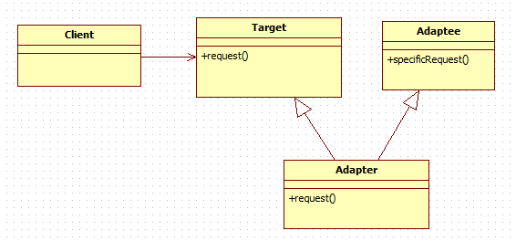

# 7-1. 어뎁터 패턴

어뎁터: 유럽식 전원 소켓에 우리나라 AC 표준 플러그를 쓰려면 어뎁터가 필요할 겁니다. 어댑터는 소켓의 인터페이스를 플러그에서 필요로하는 인터페이스로 바꿔준다고 할수 있습니다.

<aside>
💡 어댑터 패턴: 한 클래스의 인터페이스를 클라이언트에서 사용하고자하는 다른 인터페이스로 변환하여, 인터페이스에 호환성 문제에 때문에 같이 쓸 수 없는 클래스들을 연결해서 쓸수 있게 하는 것이다.

</aside>

```jsx
public interface Duck {
    public void quack();
    public void fly();

 }
```

```jsx
public class MallardDuck implements Duck {

  @Override
  public void quack() {
		System.out.println("Quack");
  }

  @Override
  public void fly() {
		System.out.println("I'm flying");
  }

 }
```

```jsx
public interface Turkey {

  public void gobble();

  public void fly();

 }
	public class WildTurkey implements Turkey{
	
	@Override
	
	public void gobble() {
	
		System.out.println("Gobble gobble");
	
	}
	
	
	@Override
	
	public void fly() {
	
		System.out.println("I'm flying a short distance");
	
	}

 }

```

Turkey 객체를 대신 사용해야하는 상황이라면, 어댑터 패턴을 이용하면 좋다.

```jsx
	public class TurkeyAdapter implements Duck {
	
	Turkey turkey;

	public TurkeyAdapter(Turkey turkey) {
	
		this.turkey = turkey;
	
	}

  @Override

  public void quack(){ 

	 turkey.gobble();

  }

  @Override

  public void fly() {

		turkey.fly();

  }

 }

```

```jsx
public class DuckTestDrive {

	public static void main(String[] args) {

		MallardDuck duck = new MallardDuck();
	  WildTurkey turkey = new WildTurkey();
	  Duck turkeyAdapter = new TurkeyAdapter(turkey);

    System.out.println("The turkey says...");
    turkey.gobble();
    turkey.fly();

    System.out.println("The Duck says...");
    testDuck(duck);

    System.out.println("The TurkeyAdapter says...");
    testDuck(turkeyAdapter);

  }

    public static void testDuck(Duck duck){ 

	   duck.quack();

     duck.fly();

    }

 }

```

**클라이언트에서 어댑터를 사용해봅시다.**

- 클라이언트에서 target interface를 사용하여 메소드를 호출하여 어댑터에 요청을 한다.
- Adapter에서는 Adaptee interface를 사용하여 그 요청을 Adaptee 에 대한 하나 이상의 메소드를 호출로 변환한다.
- 결과적으로 클라이언트에서는 호출 결과를 받지만, 중간에 Adapter가 개입했는지 전혀 알지 못한다.

Adapter의 종류

어댑터에는 **두종류**가 있는데 하나는 객체 어뎁터이고, 다른 하난 클래스 어뎁터이다.

**클래스 어댑터**



**객체 어댑터**


두 클래스 다이어그램에서 Target은 오리, Adaptee는 칠면조라 볼 수 있다.

**클래스 어댑터에서는 어뎁터를 만들 때, 타겟과 어댑티에 대해 모두 서브 클래스로 만들고, 객체 어댑터는 composition을 통해서 어댑티에 요청을 전달한다는 점을 제외하면 별다른 차이점이 없다.**

출처

[https://jusungpark.tistory.com/24?category=630296](https://jusungpark.tistory.com/24?category=630296)

[정리정리정리]
