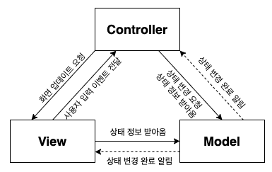

# 컴파운드 패턴

컴파운드 패턴이란 여러 디자인 패턴이 혼합된 패턴을 의미한다. 여러 패턴이 사용되는 동시에 일반적인 문제를 해결하는데 반복적으로 사용될수도 있어야한다. 대표적인 예가 MVC 패턴이다.

**MVC** 는 *Model-View-Controller로* 역할에 따라 분리하고, 재사용성을 높인 컴파운드 패턴이다.

사용된 패턴을 알아보자.

- **옵저버(Observer) 패턴**
    - Model 의 상태가 변경 되었을 때 Controller, 혹은 View 에게 이 사실을 알리는데 사용된다.
- **컴포지트(Composite) 패턴**
    - View 를 구성하는 컴포넌트들은 계층 구조를 이룬다. (e.g. Java Swing 의 JFrame/JLabel 등, Android 의 View/ViewGroup, HTML 의 DOM)
- **스트래티지(Strategy) 패턴**
    - Controller 의 핵심 기능을 인터페이스로 분리하여 View 가 이 인터페이스를 통해 Controller 를 구성(Composition) 한다. 그렇기 때문에 View 는 Controller 를 갈아 끼우며 기능을 변경할 수 있다.
