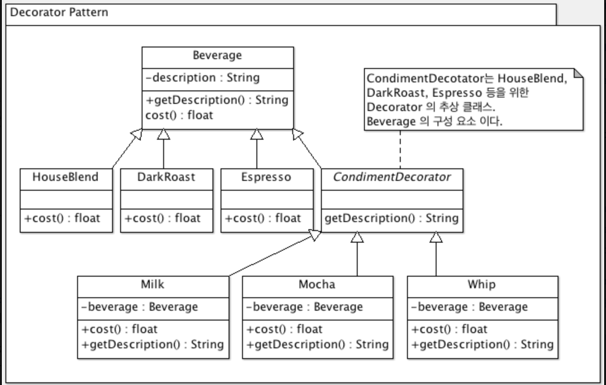

# 3. 데코레이터 패턴

상속을 남용하기 보다, 객체를 작성하는 형식으로 실행중에 클래스를 꾸미는 데코레이터 패턴을 써보도록 합시다.

### 상속 남용 문제

스타벅스의 예: Beverage라는 추상클래스가 있고 상속하는 서브 클래스가 있다. 음료에 갯수가 늘때마다 서브클래스들이 늘어나는 문제가 있다.

**OCP ( Open-Closed Principle )**

기존 코드는 건드리지 않은 채로 확장을 통해서 새로운 행동을 간단하게 추가할 수 있도록 하는게 바로 우리의 목표입니다. 즉 확장에 대해서는 열려 있어야하지만 코드 변경에 대해서는 닫혀있어야 한다는 원칙이 OCP입니다.

### 데코레이터 패턴

**스타벅스를 데코레이터 패턴으로 바꾸기**

그대신 우리는 특정 음료에서 시작해서, 첨가물로 그 음료를 decorate 할겁니다. 예를 들어 손님이 모카하고 휘핑 크림을 추가한 다크 로스트 커피를 주문한다면 다음 식으로 할수 있겟죠.

다크로스트 객체를 가져옴 → 모카객체로 장식 → 휘핑 객체로 장식 → 코스트 메소드 호출. ( 이 때 첨가물 가격을 계산하는 일은 해당 객체들에게 위임 )
assets/decorator/2020-04-10-android-decorator-pattern.png


### 데코레이터 패턴의 정의

데코레이터 패턴에서는 객체에 추가적인 요건을 동적으로 첨가한다. 데코레이터는 서브클래스를 만드는 것을 통해 기능을 유연하게 확장할수 있는 방법을 제공한다.


### 자바 코드 예시

```jsx
public class Espresso extends Beverage {
  
	public Espresso() {
		description = "Espresso"; // description은 Beverage로부터 상속받음
	}
  
	public double cost() { // 가격은 커스텀을 생각치 않고 에스프레소 가격만 입력
		return 1.99;
	}
}

public class Milk extends BeverageDecorator {
	Beverage beverage; // 데코레이션 할 음료를 저장하기 위한 인스턴스 변수
    
	public Milk(Beverage beverage) {
		this.beverage = beverage; // 생성자를 통해 데코레이션 할 음료객체를 전달
	}
 
	public String getDescription() {
		return beverage.getDescription() + ", Milk"; // 음료 설명에 Milk 추가
	}
 
	public double cost() {
		return .20 + beverage.cost(); // 음료 가격에 우유요금 추가
	}
}

public class StarbuzzCoffee {
 
	public static void main(String args[]) { // 실제 주문을 합니다
    
		Beverage beverage = new Espresso(); // 아무것도 넣지 않은 에스프레소 주문
		System.out.println(beverage.getDescription() 
				+ " $" + beverage.cost());
 
		Beverage beverage2 = new DarkRoast(); // 우유2, 휘핑1 추가한 다크로스트
		beverage2 = new Milk(beverage2);
		beverage2 = new Milk(beverage2);
		beverage2 = new Whip(beverage2);
		System.out.println(beverage2.getDescription() 
				+ " $" + beverage2.cost());
 
		Beverage beverage3 = new HouseBlend(); // 두유1, 우유1, 휘핑1 추가한 하우스블랜드
		beverage3 = new Soy(beverage3);
		beverage3 = new Milk(beverage3);
		beverage3 = new Whip(beverage3);
		System.out.println(beverage3.getDescription() 
				+ " $" + beverage3.cost());
	}
}
```

타입스크립트 코드 예시

```jsx
// decorator.ts
namespace DecoratorPattern {

    export interface Component {
        operation(): void;
    }

    export class ConcreteComponent implements Component {
        private s: String;

        constructor(s: String) {
            this.s = s;
        }

        public operation(): void {
            console.log("`operation` of ConcreteComponent", this.s, " is being called!");
        }
    }

    export class Decorator implements Component {
        private component: Component;
        private id: Number;

        constructor(id: Number, component: Component) {
            this.id = id;
            this.component = component;
        }

        public get Id(): Number {
            return this.id;
        }

        public operation(): void {
            console.log("`operation` of Decorator", this.id, " is being called!");
            this.component.operation();
        }
    }

    export class ConcreteDecorator extends Decorator {
        constructor(id: Number, component: Component) {
            super(id, component);
        }

        public operation(): void {
            super.operation();
            console.log("`operation` of ConcreteDecorator", this.Id, " is being called!");
        }
    }
}
```

å

```jsx
// demo.ts
/// <reference path="decorator.ts" />
namespace DecoratorPattern {
	export namespace Demo {

		export function show() : void {
			var decorator1: DecoratorPattern.Decorator = new DecoratorPattern.ConcreteDecorator(1, new DecoratorPattern.ConcreteComponent("Comp1"));

			decorator1.operation();
		}
	}
}
```

---

참고 문서

영훈 블로그의 Decorator Pattern (디자인 패턴 3장) ( [링크](https://kimyounghoons.github.io/java/kotlin/android-decorator-pattern/) )

hanna2100 blog **[디자인패턴] 3. 데코레이터 패턴 개념과 예제 (decorator pattern) ( [링크](https://velog.io/@hanna2100/%EB%94%94%EC%9E%90%EC%9D%B8%ED%8C%A8%ED%84%B4-3.-%EB%8D%B0%EC%BD%94%EB%A0%88%EC%9D%B4%ED%84%B0-%ED%8C%A8%ED%84%B4-%EA%B0%9C%EB%85%90%EA%B3%BC-%EC%98%88%EC%A0%9C-decorator-pattern) )**

**[design_patterns_in_typescript](https://github.com/torokmark/design_patterns_in_typescript)**
