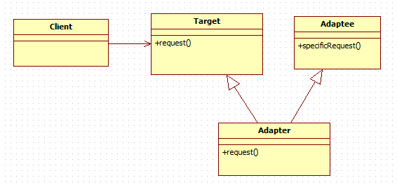

# 7-2. 퍼사드 패턴

**퍼사드패턴 (facade pattern)**

<aside>
💡 어떤 서브시스템의 일련의 인터페이스에 대한 통합된 인터페이스를 제공한다. 퍼사드에서 고수준 인터페이스를 정의하기 때문에 서브시스템을 더 쉽게 사용할수 있다.

</aside>

패턴을 사용할때는 패턴이 어떤 용도로 쓰이는지를 잘 알아둬야 하는데, 퍼사드 패턴은 단순화된 인터페이스를 통해서 서브시스템을 더 쉽게 사용하기 위한 용도이다.



홈씨어터를 이용하는 과정은 꽤나 복잡한 일이다.

DVD 영화를 틀려면

팝콘 기계를 켠다. → 팝콘 튀기기 → 전등을 어둡게 조절 → 스크린을 내린다 → ... → DVD 플레이어를 켠다 → DVD를 재생한다

반대로 영화를 끄려면 방금전의 일을 역순으로 처리해야하니, 머리아프다.

이렇게 일련의 작업들이 수행되어야할 때, 퍼사드를 이용하면 좋다.

```jsx
public class HomeTheaterFacade {
	
	Amplifier amp;
	
	Tuner tuner;
	
	Dvdplayer dvd;
	
	CdPlayer cd;
	
	Projector projector;
	
	TheaterLights lights;
	
	Screen screen;
	
	PopcornPopper popper;
	

public HomeTheaterFacade( Amplifier amp,

                          Tuner tuner, 

                          DvdPlayer dvd,

                          CdPlayer cd,

                          Projector projector,

                          Screen screen,

                          TheaterLights lights,

                          PopcornPopper popper) {

	  this.amp = amp;
	
	  this.tunner = tuner;
	
	  this.dvd = dvd;
	
	  this.cd = cd;
	
	  this.projector = projector;
	
	  this.screen = screen;
	
	  this.lights = lights;
	
	  this.popper = popper;
	
	}
	
	public void watchMovie (String movie) {
	
	  System.out.println("Get ready to watch a movie...");
	
	  popper.on();
	
	  popper.pop();
	
	  lights.dim(10);
	
	  screen.down();
	
	  projector.on();
	
	  projector.wideScreenMode();
	
	  amp.on();
	
	  amp.setDvd(dvd);
	
	  amp.setsurroundSound();
	
	  amp.setVolume(5);
	
	  dvd.on();
	
	  dvd.play(movie);
	
	}
		
	public void endMovie() {
	
		System.out.println("Shutting movie theater down...");
		
		popper.off();
		
		lights.on();
		
		screen.up();
		
		projector.off();
		
		amp.off();
		
		dvd.stop();
		
		dvd.eject();
		
		dvd.off();
	
	}

 }

```

```jsx
	public class HomeTheaterTestDrive {
	
	public static void main(String[] args) {
	
		// instantiate components here
		
		HomeTheaterFacade homeTheater  = new HomeTheaterFacade(amp, tuner, dvd, cd, projector, screen, lights, popper);
		
		homeTheater.watchMovie("타짜");
		
		homeTheater.endMovie();
	}

}

```

**최소 지식 원칙.**

정말 친한 친구하고만 얘기하라는 원칙이다. 즉 어떤 객체든간에 그 객체와 상호작용을 하는 클래스 개수에 주의해야하고, 그런 객체들과 어떤식으로 상호작용하는지도 주의를 기울여야한다는 뜻이다. 어떻게 하면 할수 있을 까? 다음과 같은 종류의 메소드만 호출하면된다.

1. 객체 자신의 메소드
2. 메소드의 매개변수로 넘어온 인자의 메소드
3. 메소드 내부에서 생성 된 객체의 메소드
4. 메소드가 포함하고 있는 객체의 메소드

```jsx
// Don't
public float getTemp() {
	
	Thermometer thermometer = station.getThermometer(); 
	
	return thermometer.getTemperature();                    

}
```

```jsx
// Do
public float getTemp() {
		return station.getTemperature();   
}
```

출처

[https://jusungpark.tistory.com/24?category=630296](https://jusungpark.tistory.com/24?category=630296)

[정리정리정리]
