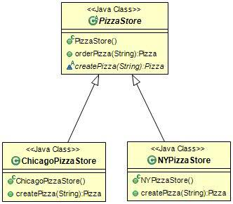
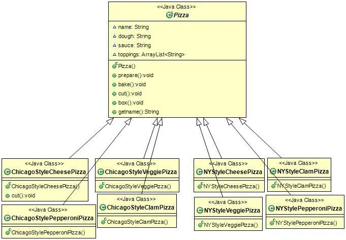
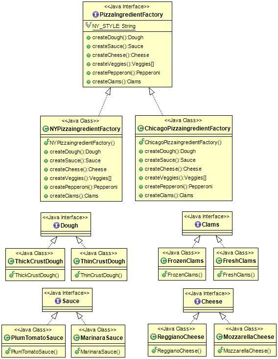

# 4. 팩토리 패턴

느슨한 결합을 이용하는 객체지향 디자인을 만들어봅시다.

### new에 대해

아래와 같은 코드를 확장해야할 떄는 코드를 다시 확인하고 추가 또는 제거해야만 합니다. 이런 코드를 만들면 관리 및 갱신이 어렵고, 오류가 생길 가능성이 큽니다.

```jsx
Duck duck;

 if ( type == picnic ) duck = new MallardDuck();

 else if ( type == hunting ) duck = new DecoyDuck();

 else if ( type == inBathTub) duck = new RubberDuck();

```

인터페이스에 맞춰서 코딩을 하면 시스템에 변화를 이겨낼수 있다.  이유는 다형성 덕분에 어떤 클래스든 특정 인터페이스만 구현하면 사용할수 있기 때문이다.

그러나, 구상 클래스를 많이 사용하면 새로운 구상 클래스가 추가될 때마다 코드를 고쳐야 하기에 문제가 생길수 있다. 즉 변화에 닫혀 있는 코드가 되어버리는 것이다.

디자인 원칙으로 봤을때 구상 클래스를 바탕으로 코딩을 하면 나중에 코드를 수정해야 할 가능성이 높아지고, 유연성이 떨어진다는것이다. 따라서,  **바뀔 수 있는 부분을 찾아내서 바뀌지 않는 부분하고 분리시켜야 한다는 원칙**을 다시 적용해보자.

### pizza 예시 - 안좋은 코드

```jsx
Pizza orderPizza(String type) {

       Pizza pizza;

       if(type.equals("cheese")) pizza = new CheesePizza();

       else if(type.equals("greek")) pizza = new GreekPizza();

       else if(type.equals("pepperoni")) pizza = new PepperoniPizza();       

       pizza.prepare();

       pizza.bake();

       pizza.cut();

       pizza.box();

       return pizza;

 } 

```

### 캡슐화와 Factory

앞선 안좋은 코드 예시에서 피자 종류에서 분기되는 부분을 빼내 피자객체를 만드는 일만 전담하는 다른 객체에 넣어보도록 합시다. 그리고 새로 만들 객체에는 **Factory**라고 이름 붙이기로해요.

객체 생성을 처리하는 클래스를 팩토리라고 부릅니다.

```jsx
public class SimplePizzaFactory {	

	public Pizza createPizza(String type){ //이런 경우에는 static메소드로 선언하는 경우가 종종 있음.

		Pizza pizza = null;

		if(pizza.equals("cheese")) pizza = new CheesePizza();

		if(pizza.equals("pepper")) pizza = new PepperoniPizza();

		if(pizza.equals("clam")) pizza = new ClamPizza();

		if(pizza.equals("veggie")) pizza = new VeggiePizza();

		return pizza;

	}

 }

```

이렇게 빼내서 팩토리로 사용하면 좋은점은 SimplePizzaFactory를 사용하는 클라이언트가 매우 많을 수 있다는 점을 생각해보세요. 수정이 있을 때 여기저기 가서 고칠 필요가 없다는 것입니다.

```jsx
public class PizzaStore{

	SimplePizzaFactory simplePizzaFactory;

	

	public PizzaStore(SimplePizzaFactory simplePizzaFactory) {

		this.simplePizzaFactory = simplePizzaFactory;

	}

	

	public Pizza orderPizza(String type){

		Pizza pizza;

		
		pizza = simplePizzaFactory.createPizza(type);

		

		pizza.prepare();

		pizza.bake();

		pizza.cut();

		pizza.box();

		return pizza;

	}

 }

```

### **팩토리 메소드 패턴**

피자가게와 피자 제작 과정 전체를 하나로 묶어주는 프레임워크를 만들어야 합니다. 피자를 만드는 활동 자체는 전부 PizzaStore 클래스에 국한시키면서도 분점마다 고유의 스타일을 살리수 있는 방법을 고안해봅시다.

createPizza를 다시 PizzaStore에 넣고, 그 메소드를 추상 메소드로 선언합니다. 각 지역마다 고유의 스타일에 맞게 PizzaStore의 서브 클래스에서 만들수 있도록 할겁니다.

```jsx
public abstract class PizzaStore{

	public Pizza orderPizza(String type){

		Pizza pizza;

		

		pizza = createPizza(type);

		

		pizza.prepare();

		pizza.bake();

		pizza.cut();

		pizza.box();

		return pizza;

	}

	

	abstract Pizza createPizza(String type); //Pizza 인스턴스를 만드는 일은 팩토리 역할을 하는 메소드에서 맡아 처리

 }

```



```jsx
public class PizzaTestDrive {

	public static void main(String[] args) {

		PizzaStore nyStore = new NYPizzaStore();

		PizzaStore chicagoStore = new ChicagoPizzaStore();

		

		Pizza nySytpePizza = nyStore.orderPizza("cheese");

		System.out.println(nySytpePizza.getname());

		System.out.println();

		Pizza chicagoStypePizza = chicagoStore.orderPizza("cheese");

		System.out.println(chicagoStypePizza.getname());

	}

 } 
```

팩토리 메소드 패턴에서는 서브 클래스에서 어떤 클래스를 만들지를 결정하게 함으로써 객체 생성을 캡슐화 합니다.

이제 ChicagoPizzaStore, NYPizzaStore 에는구상 피자클래스를 분기해주는 각각의 createPizza 메소드가 있습니다.

```jsx
public class NYPizzaStore extends PizzaStore{

	@Override

	public Pizza createPizza(String type){

		Pizza pizza = null;

		if(type.equals("cheese")) pizza = new NYStyleCheesePizza();

		if(type.equals("peper")) pizza = new NYStylePepperoniPizza();

		if(type.equals("clam")) pizza = new NYStyleClamPizza();

		if(type.equals("veggie")) pizza = new NYStyleVeggiePizza();

		return pizza;

	}

 } 
```

```jsx
public class ChicagoPizzaStore extends PizzaStore{

	@Override

	public Pizza createPizza(String type){

		Pizza pizza = null;

		if(type.equals("cheese")) pizza = new ChicagoStyleCheesePizza();

		if(type.equals("peper")) pizza = new ChicagoStylePepperoniPizza();

		if(type.equals("clam")) pizza = new ChicagoStyleClamPizza();

		if(type.equals("veggie")) pizza = new ChicagoStyleVeggiePizza();

		return pizza;

	}

 } 
```

```jsx
public abstract class Pizza{
	String name;
	String dough;
	String sauce;
	ArrayList<String> toppings = new ArrayList<>();
	
	public void prepare(){
		System.out.println("Preparing : "+name);
		System.out.println("Tossing dough...");
		System.out.println("Adding source");
		System.out.println("Adding toppings");
		for (String topping : toppings) {
			System.out.println("\ttopping : "+topping);
		}
	}
	
	public void bake(){
		System.out.println("Bake for 25 minutes at 350");
	}
	
	public void cut(){
		System.out.println("Cutting the pizza into diagonal slices");
	}
	
	public void box(){
		System.out.println("Place pizza in official PizzaStore box");
	}
	
	public String getname(){
		return this.name;
	}
	
 }
```

```jsx
public class NYStyleCheesePizza extends Pizza{

	public NYStyleCheesePizza() {

		this.name = "NY Style CheesePizza";

		this.dough = "Thin Crust Dough";

		this.sauce = "Marinara Sauce";

		this.toppings.add("Grated Reggiano Cheese");

	}

 }
```

```jsx
public class ChicagoStyleCheesePizza extends Pizza{

	public ChicagoStyleCheesePizza() {

		this.name = "Chicago Style CheesePizza";

		this.dough = "Extra Thick Crust Dough";

		this.sauce = "Plum Tomato Sauce";

		this.toppings.add("Shredded mozzarella Cheese");

	}

	

	@Override

	public void cut() {

		System.out.println("Cutting the pizza into square slices");

	}

 }

```

```jsx
public class PizzaTestDrive {

	public static void main(String[] args) {

		PizzaStore nyStore = new NYPizzaStore();

		PizzaStore chicagoStore = new ChicagoPizzaStore();

		

		Pizza nySytpePizza = nyStore.orderPizza("cheese");

		System.out.println(nySytpePizza.getname());

		System.out.println();

		Pizza chicagoStypePizza = chicagoStore.orderPizza("cheese");

		System.out.println(chicagoStypePizza.getname());

	}

 } 
```

모든 팩토리 패턴에서는 객체 생성을 캡슐화 한다. 팩토리 메소드 패턴에서는 서브 클래스에서 어떤 클래스를 만들지를 결정하게 함으로써 객체 생성을 캡슐화 한다.

### 의존성 역전의 원칙



디자인 원칙: 추상화된것에 의존하도록 만들어라. 구성 클래스에 의존하지마라.

- 이런식으로 의존이 되던 좋지않은 디자인이
    
    **PizzaStore** -> **Pizza**
    
    **Pizza** <- NYStyleCheesePizza
    
    **Pizza** <- ChicagoStyleCheesePizza
    
    **Pizza** <- NYStyleVeggiePizza
    
    에 의존하는 식으로 의존관계가 뒤집혀졌다.
    

- 팩토리 메소드 패턴을 적용하고 나면 **고수준 구성요소(PizzaStore)와 저수준 구성요소(NYStyleCheesePizza, ChicagoStylePizza, ..)가 추상 클래스인 Pizza에 의존하게된다.** 즉 팩토리 패턴이 의존성 역전의 원칙을 위해 쓸수 있는것이다.

# **추상 팩토리 패턴**

원재료를 각 스토어에서 다르게 쓴다고 가정하고, 원재료 Factory를 만들어보자.

지역별로 다른 메소들르 구현하는 PizzaIngredientFactory 인터페이스를 만들자. 또, RedPeppers, ThickCrustDough 등의 원재료 클래스를 구현한다. 만든 원재료 공장을 PizzaStore 코드에서 사용하자.

```jsx
public interface PizzaIngredientFactory {

	public Dough createDough();

	public Sauce createSauce();

	public Cheese createCheese();

	public Veggies[] createVeggies();

	public Pepperoni createPepperoni();

	public Clams createClams();

 } 
```

```jsx
public class NYPizzaingredientFactory implements PizzaIngredientFactory{

	@Override

	public Dough createDough() {

		return new ThinCrustdough();

	}

	@Override

	public Sauce createSauce() {

		return new MarinaraSauce();

	}

	@Override

	public Cheese createCheese() {

		return new ReggianoCheese();

	}

	@Override

	public Veggies[] createVeggies() {

		Veggies veggies[] = { new Farlic(), new Onion(), new Mushroom(), new RedPepper() };

		return veggies;

	}

	@Override

	public Pepperoni createPepperoni() {

		return new SlicedPepperoni();

	}

	@Override

	public Clams createClams() {

		return new Freshclams();

	}

 }

```

```jsx
public class ChicagoPizzaingredientFactory implements PizzaIngredientFactory{
	@Override
	public Dough createDough() {
		return new ThickCrustDough();
	}

	@Override
	public Sauce createSauce() {
		return new PlumTomatoSauce();
	}

	@Override
	public Cheese createCheese() {
		return new MozzarellaCheese();
	}

	@Override
	public Veggies[] createVeggies() {
		Veggies veggies[] = { new BlackOlives(), new Spinach(), new EggPlant()};
		return veggies;
	}

	@Override
	public Pepperoni createPepperoni() {
		return new Slicedpepperoni();
	}

	@Override
	public Clams createClams() {
		return new FrozenClam();
	}
 }

```

```jsx
public abstract class Pizza{
	String name;
	Dough dough;
	Sauce sauce;
	Veggies veggies[];
	Cheese cheese;
	Pepperoni pepperoni;
	Clams clams;
	
	public abstract void prepare(); //추상 메소드로 변경됨.
	
	public void bake(){
		System.out.println("Bake for 25 minutes at 350");
	}
	
	public void cut(){
		System.out.println("Cutting the pizza into diagonal slices");
	}
	
	public void box(){
		System.out.println("Place pizza in official PizzaStore box");
	}
	
	public String getname(){
		return this.name;
	}
 } 

```

```jsx
public class CheesePizza extends Pizza{

	PizzaIngredientFactory ingredientFactory;

	

	public CheesePizza(PizzaIngredientFactory ingredientFactory) {

		this.ingredientFactory = ingredientFactory;

	}

	@Override

	public void prepare() {

		this.dough = ingredientFactory.createDough();

		this.sauce = ingredientFactory.createSauce();

		this.cheese = ingredientFactory.createCheese();

	}

 } 

```

```jsx
public class ClamPizza extends Pizza{

	PizzaIngredientFactory ingredientFactory;

	

	public ClamPizza(PizzaIngredientFactory ingredientFactory) {

		this.ingredientFactory = ingredientFactory;

	}

	@Override

	public void prepare() {

		this.dough = ingredientFactory.createDough();

		this.sauce = ingredientFactory.createSauce();

		this.cheese = ingredientFactory.createCheese();

		this.clams = ingredientFactory.createClams();

	}

 }

```

```jsx
public class NYPizzaStore extends PizzaStore{

	@Override

	public Pizza createPizza(String type){

		Pizza pizza = null;

		PizzaIngredientFactory ingredientFactory = new NYPizzaingredientFactory();

		if(type.equals("cheese")){

			pizza = new CheesePizza(ingredientFactory);

			pizza.setName(ingredientFactory.NY_STYLE+" Cheese Pizza");

		}else if(type.equals("peper")){

			pizza = new PepperoniPizza(ingredientFactory);

			pizza.setName(ingredientFactory.NY_STYLE+" Pepperoni Pizza");

		}else if(type.equals("clam")){

			pizza = new ClamPizza(ingredientFactory);

			pizza.setName(ingredientFactory.NY_STYLE+" Clam Pizza");

		}else if(type.equals("veggie")){

			pizza = new VeggiePizza(ingredientFactory);

			pizza.setName(ingredientFactory.NY_STYLE+" Veggie Pizza");

		}

		return pizza;

	}

 } 
```



- **피자 스토어를 만든다.**
    
    **PizzaStore nyPizzaStore = new NYPizzaStore();**
    
- **주문을 시작한다**
    
    **nyPizzaStore.orderPizza("cheese");**
    
- **orderPizza에서 createPizza() 메소드를 호출한다**
    
    **Pizza pizza = createPizza("cheese");**
    
- **createPizza() 메소드가 호출되면 원재료 공장에서 일을 시작한다.**
    
    **Pizza pizza = new CheesePizza(nyIngredientFactory);**
    
- **피자를 준비하는 prepare()메소드가 호출되면 팩토리에 원재료 주문이 들어간다.**

```jsx
void prepare(){

	dough = nyIngredientFactory.createDough();**
	
	sauce = nyIngredientFactory.createSauce();**
	
	cheese = nyIngredientFactory.createCheese();**
	
	}
```

- **준비단계가 끝나고 orderPizza() 메소드에서는 피자를 굽고, 자르고, 포장한다.**

### 정리

추상팩토리 패턴: 제품군을 생성하기 위한 인터페이스를 구성하여 사용할수 있게끔 하는것.

추상메소드 패턴: 하나의 추상클래스에서 추상 메소드를 만들고 서브클래스들이 그 추상메소드를 구현하여 인스턴스를 만들게끔 하는것.

---

참고 문서

[https://jusungpark.tistory.com/14](https://jusungpark.tistory.com/14)
