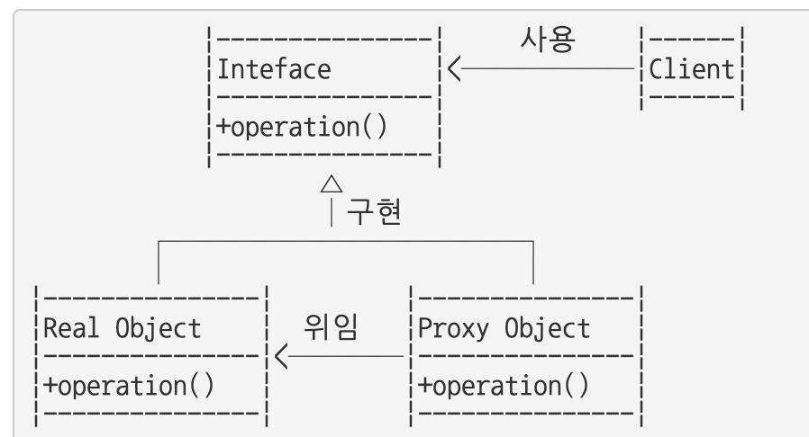

# 11. 프록시 패턴

인터페이스를 사용하고 실행시킬 클래스에 대한 객체 대신 대리자 객체를 이용하는 것이다. 클라이언트 쪽에서 실제 실행시킬 클래스에 대해서는 전혀 모르는 상태입니다.

프록시는 비서역할로, 흐름제어만할 뿐 결과값을 조작하거나, 변경시키면 안됩니다. 비서역할로, 만약 연락처목록을 전달하라고 했다면 이를 수정하거나, 임의로 다루면 안되는것 처럼, 프록시도 어떤 행위보다는 제어의 흐름을 변경하거거나, 다른 로직을 수행하기 위해 사용합니다

하나 더 추가적으로 Proxy 패턴에 특징은 다음과 같습니다.

- **대리자는 실제 서비스와 같은 이름의 메서드를 구현한다. 이때 인터페이스를 사용한다.**
- **대리자는 실제 서비스에 대한 참조 변수를 갖는다(합성)**
- **대리자는 실제 서비스의 같은 이름을 가진 메서드를 호출하고 그 값을 클라이언트에게 돌려준다.**
- **대리자는 실제 서비스의 메서드 호출 전후에도 별도의 로직을 수행할 수도 있다.**

- Real Object, Proxy Object는 동일한 인터페이스를 구현합니다.
- Proxy Object는 메서드 수행시 실제 객체(Real Object)의 메서드에 위임합니다.

## **프록시가 사용되는 대표적인 3가지**

### **가상프록시**

필요한 시점까지 객체 생성을 연기하며, 객체가 생성된것처럼 동작하고 싶을때 사용합니다. 프록시 클래스에서 중요하지 않은 자잘한 일들을 맡고, 리소스가 많이 요구되는 작업들애 주체 클래스를 사용하도록 구현합니다. 해상도가 아주 높은 이미지를 처리해야하는 경우 먼저 텍스트만 나오도록 작업을 분산하는 것을 예를 들수 있습니다.

### **원격프록시**

원격 객체에 대한 접근제어는 로컬 환경에 있으며, 원격객체에 대한 대변자 역할을 하는 것입니다. 서로 다른 주소를 가지고 있지만 같은 공간에 있는 것처럼 하는 패턴입니다. 예를 들자면, Google Docs를 들수 있습니다.

### **보호프록시**

주체 클래스에 대한 접근을 제어하기 위해 만든 것입니다. 객체에 대한 접근을 통제하거나, 객체마다 접근 권한을 다르게 설정하고 싶을 때, 프록시 클래스에서 접근을 허용할지 말지 핸들링하게 할수 있습니다.
