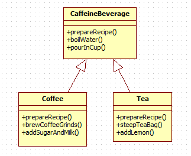

# 8. 템플릿 메소드 패턴

**템플릿 메소드 패턴 (template method pattern)**

메소드에서의 알고리즘의 뼈대를 정의하는 것이다. 알고리즘의 여러 단계중에 일부는 서브클래스에서 구현할수 있는데, 템플릿 메소드를 이용하면 알고리즘 구조는 그대로 유지하면서 서브클래스에서 특정 단계를 재정의 할수 있다.

커피와 차가 만들어 지는법을 비교해보자.

1. 커피 만드는 법

1) 물을 끓인다.

2) 끓는 물에 커피를 우려낸다.

3) 커피를 컵에 따른다.

4) 설탕과 우유를 추가한다.

2. 홍차 만드는 법

1) 물을 끓인다.

2) 끓는 물에 차를 우려낸다.

3) 차를 컵에 따른다.

4) 레몬을 추가한다.

동일한 부분을 정리하자면 두 가지 만드는 법의 알고리즘이 거의 똑같다는 것을 알 수 있다.

1. 물을 끓인다.

2. 뜨거운 물을 이용하여 커피 또는 홍차를 우려낸다.

3. 만들어진 음료를 컵에 따른다.

4. 각 음료에 맞는 첨가물을 추가한다.

```jsx
void prepareRecipe() {

	boilWater();
	
	brew();
	
	pourInCup();
	
	addCondiments();

}
```

```jsx
public abstract class CaffeineBeverage {

	void final prepareRecipe() {
		boilWater();
		brew();
		pourInCup();
		addcondiments();
	}
	
	abstract void brew();
	abstract void addcondiments();

	void boilWater() {
		System.out.println("물 끓이는 중");	
	}

	void pourInCup() {
		System.out.println("컵에 따르는 중");
	}

}

```

```jsx
public class Coffee extends CaffeineBeverage {
	@Override
	void brew() {
		System.out.println("필터를 통해 커피를 우려내는 중");
	}

	@Override
	public void addCondiments() {
		System.out.println("설탕과 우유를 추가하는 중");
	}

}

```

```jsx
public class Tea extends CaffeineBeverage {
	@Override
	void brew() {
		System.out.println("차를 우려내는 중");
	}

	@Override
	public void addCondiments() {
		System.out.println("레몬을 추가하는 중");
	}

}

```

**템플릿 메소드와 후크**

후크(hook)는 추상클래스에서 선언되는 메소드이지만, 기본적인 것으로만 구현되어 있거나 아무 코드도 들어있지 않다. 이렇게 하면 서브클래스 입장에서는 다양한 위치에서 알고리즘에 끼어들수 있다.

```jsx
public abstract class CaffeineBeverageWithHook {

	void final prepareRecipe() {
	
		boilWater();
		brew();
		pourInCup();
	
		if ( customerWantsCondiments() ) {
			addcondiments();
		}
	}

		abstract void brew();
		abstract void addcondiments();
		
		void boilWater() {
		
		System.out.println("물 끓이는 중");

	}

	void pourInCup()[ {
	
		System.out.println("컵에 따르는 중");
	
	}
	

		boolean customerWantsCondiments() { // 서브클래스에서 필요에 따라 오버라이드 할수 있는 메소드

		return true;                                

	}

}
```

여기서 customerWantscondiments() 메소드는 별 내용이 없는 기본 메소드를 구현해 놓은 후크 메소드이다.

후크는 서브클래스에서 적절하게 오버라이드 해서 사용하면 된다.

```jsx
public class CoffeeWithHook extends CaffeineBeverageWithHook {

	@Override
	void brew() {
		System.out.println("필터를 통해 커피를 우려내는 중");
	
	}
	
	@Override
	public void addCondiments() {
		System.out.println("설탕과 우유를 추가하는 중");
	
	}

	@Override
	public boolean customerWantsCondiments() {
		String answer = getUserInput();
		if( answer.toLowerCase().startWith("y")) return true;
		else return false;
	
	}

	private String getUserInput() {
	
	// 입력받는 로직
	
	}

}

```

이처럼 알고리즘에서 필수적이지 않은 부분을 필요에 따라 선택적으로 서브클래스에서 구현하든 안하든 상관없는 매서드의 경우에 hook을 사용합니다.

**헐리우드 원칙**

<aside>
💡 먼저 연락하지 마세요. 저희가 연락 드리겠습니다.

</aside>

어떤 고수준 구성요소가 저수준 구성요소에 의존하고, 그 저수준 구성요소는 다시 고수준 구성요소에 의존하고, 그 고수준 구성요소는 다시 또 다른 구성요소에 의존하는 식으로 의존성이 복잡하게 꼬여있는 것을 의존성 부패라고 한다.

헐리우드 원칙을 사용하면, 저수준 구성요소에서 시스템에 접속을 할수는 있지만, 언제 어떤 식으로 그 구성요소들을 사용할지는 고수준 구성요소에서 결정하게 됩니다.

즉 저수준 구성요소는 computation에 참여할 수는 있지만 절대 고수준 구성요소를 직접 호출할수 없는거죠.



CaffeineBeverage는 고수준 구성요소이며, 음료를 만드는 알고리즘을 장악하고있고, 메소드 구현이 필요한 상태에서만 서브클래스를 불러낸다 즉 Coffee와 Tea 와 같은 서브클래스는 각각의 자질구레한 메소드 구현을 제공하기 위한 용도로만 쓰인다. 이와같은 서브클래스들은 고수준 구성요소인 CaffeineBeverage 클래스로부터 호출 당하기 전까지는 절대로 CaffeineBeverage 추상 클래스를 직접 호출하지 않는다.

이렇게 함으로 CaffeineBeverage 클래스의 클라이언트에서는 Tea나 Coffee 같은 구상 클래스가 아닌 CaffeineBeverage에 추상화 되어 있는 부분에 의존하게 된다. 그렇게 함으로써 전체 시스템의 의존성이 줄어들 수 있다.

---

출처

[https://jusungpark.tistory.com/24?category=630296](https://jusungpark.tistory.com/24?category=630296)

[정리정리정리]
