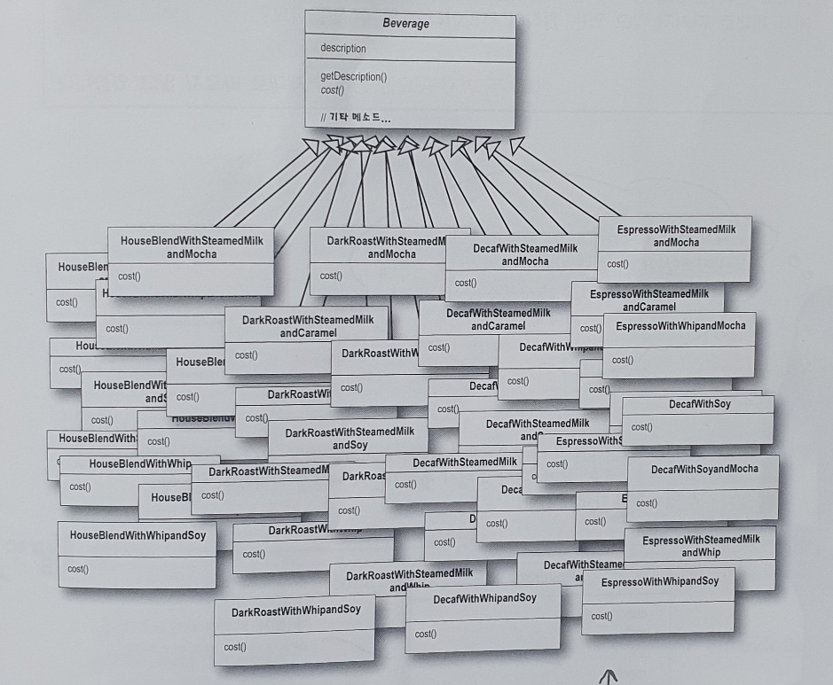
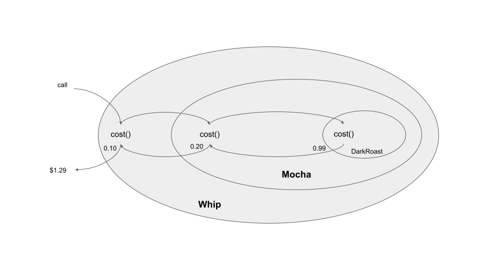

# 3장

## 스타벅스 커피 주문 시스템

커피를 주문할때 스팀 우유, 두유, 모카(초콜릿)등을 추가하고 그 위에 휘핑 크림을 얹기도 합니다. 각각을 추가할 때마다 커피 가격을 올리기 때문에, 주문 시스템에서도 그런 점들을 모두 고려해야 합니다.

### 구현1



### 문제점

- 모든 경우의 수를 대응할 수 없다
- 모든 서브클래스의 cost() 메소드를 구현해야 합니다

### 구현2


### 문제점

- 첨가물 가격이 바뀔 때마다 기존 코드를 수정해야 합니다
- 첨가물의 종류가 많아지면 새로운 메소드를 추가해야 하고, 수퍼 클래스의 cost() 메소드도 고쳐야 합니다.
- 새로운 음료가 출시될때 들어가면 안되는 첨가물이 있어도 필요없는 첨가물에 대한 메소드를 상속받게 됩니다.
- 더블 모카등의 커스텀 수문에 대응 할 수 없다.

## 디자인 원칙

### OCP(Open Close PrinCiple)

코드는 확장에 대해서는 열려 았어야 하지만 코드 변경에 대해서는 닫혀 있어야 합니다.

- 확장 ← 커피에 여러 첨가물을 추가하고 가격을 추가하는 것
- 코드 변경 ← 기존 커피를 만드는 코드 또는 Cost() 함수

기존 코드를 건드리지 않은 채로 확장을 통해서 새로운 행동을 추가 해야 합니다

## 데코레이터 패턴(Decorator pattern)

데코레이터 패턴에서는 객체에 추가적인 요건을 동적으로 첨가한다. 데코레이터는 서브클래스를 만드는것을 통해서 기능을 유연하게 확장할 수 있는 방법을 제공한다.

- 데코레이터의 수퍼클래스는 자신이 장식하고 있는 객체의 수퍼클래스와 같습니다.
- 한 객체를 야러 개의 데코레이터로 감쌀 수 있습니다.
- 데코레이터는 자신이 감싸고 있는 객체와 같은 수퍼클래스를 가지고 있기 때문에 원래 객체가 들어갈 자리에 데코레이터 객체를 집어넣어도 상관 없습니다.
- 데코레이터는 자신이 장식하고 있는 객체에게 어떤 행동을 위임하는 것 외에 원하는 추가적인 작업을 수행할 수 있습니다. (중요)
- 객체는 언제든지 감쌀 수 있기 때문에 실행중에 필요한 데코레이터를 마음대로 적용할 수 있습니다.

## 음료 코드 구현

```kotlin
// 음료 클래스
abstract class Beverage {
    open val description = "제목 없음"
    abstract fun cost(): Double
}

class Espresso : Beverage() {
    override val description = "에스프레소"
    override fun cost(): Double = 1.99 // 기본 음료 가격
}

class DarkRoast : Beverage() {
    override val description: String = "다크 로스트 커피"
    override fun cost(): Double = 0.99 // 기본 음료 가격
}
```

## 첨가물 코드 구현

Beverage()를 상속받은 첨가물 추상 클래스 생성

이 추상클래스를 상속받은 서브클래스는 모두 cost()메소드와 getDescription()메소드를 구현해야 합니다.

```kotlin
// 첨가물 코드
abstract class CondimentDecorator : Beverage() {
    abstract override val description: String
}

class Mocha(
    private val beverage: Beverage
) : CondimentDecorator() {
    override val description: String
        get() = "${beverage.description}, 모카"
    override fun cost() = 0.20 + beverage.cost() //입력 음료 클래스 + 첨가물 가격
}

class Whip(
    private val beverage: Beverage
) : CondimentDecorator() {
    override val description: String
        get() = "${beverage.description}, 휘핑"
    override fun cost() = 0.10 + beverage.cost() //입력 음료 클래스 + 첨가물 가격
}
```

## 커피를 주문해 봅시다

코드 실행중 데코레이터 패턴을 적용해 동적으로 커피에 모카와 휘핑을 추가했다.

```kotlin
// 실행 코드
fun main(){
    val beverage:Beverage = Espresso()
    println("${beverage.description}  ${beverage.cost()}")

    var beverage2:Beverage = DarkRoast()
    beverage2 = Mocha(beverage2)
    beverage2 = Whip(beverage2)
    println("${beverage2.description}  ${beverage2.cost()}")
}
```

```
[실행결과]
에스프레소  1.99
다크 로스트 커피, 모카, 휘핑  1.29
```



데코레이터를 모두 구성한 뒤 cost()를 호출하면 그림과 같은 순서로 가격을 가져온다

### 장점

- 코드 실행시 동적으로 첨가물을 결정
    - 서브 클래스를 만드는 방식으로 행동을 상속 받으면 그행동은 컴파일시에 완전히 결정됩니다. 하지만 구성을 통해서 객체의 행동을 확장하면 실행중에 동적으로 행동을 정할 수 있습니다
- 기존 코드를 건드리지 않기 때문에 기존 코드에서 새로운 버그가 생기거나 의도하지 않은 부작용이 발생하는 것을 원천봉쇄 할 수 있습니다.

### 단점

- 사용자가 특정 형식에 의존하는 클라이언트 코드를 가지고 데코레이터 패턴을 적용하면 문제가 생길수 있다
- 구성요소를 초기화하는 데 필요한 코드가 훨씬 복잡해질수 있다 (인스턴스를 여러개의 데코레이터로 감싸는 과정)