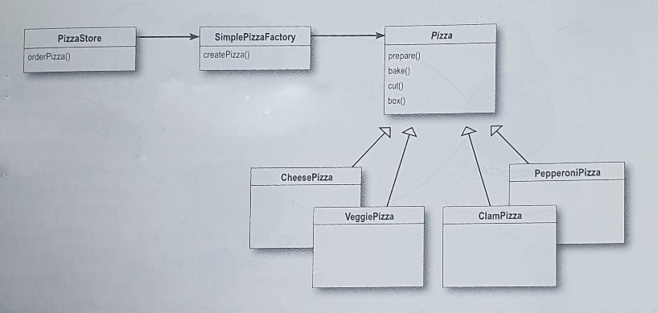

# 4장

## New에 대해

```kotlin
val duck = if (picnic) MallarDuck()
    else if (hunting) DecoyDuck()
    else if (inBathTub) RubberDuck()
    else null
```

이런 코드가 있다는 것은 뭔가 변경하거나 확장해야 할 때 코드를 다시 확인하고 추가 또는 제거해야 한다는 것을 뜻합니다.

따라서 이런코드는 관리가 어렵고 오류가 생길 가능성이 높아지게 됩니다.

객체를 생성하는 부분을 캡슐화하여 코드를 작성해봅시다

## 객체 의존성 살펴보기

```kotlin
class DependentPizzaStore() {
    fun createPizza(style: String, type: String): Pizza? {
        val pizza = when (style) {
            "NY" -> {
                when (type) {
                    "cheese" -> NYStyleCheesePizza()
                    "pepper" -> NYStylePepperoniPizza()
                    "clam" -> NYStyleClamPizza()
                    "veggie" -> NYStyleVeggiePizza()
                    else -> null
                }
            }
            "Chicago" -> {
                when (type) {
                    "cheese" -> ChicagoStyleCheesePizza()
                    "pepper" -> ChicagoStyleStylePepperoniPizza()
                    "clam" -> ChicagoStyleStyleClamPizza()
                    "veggie" -> ChicagoStyleStyleVeggiePizza()
                    else -> null
                }
            }
            else -> null
        }
        pizza.prepare()
        pizza.bake()
        pizza.cut()
        pizza.box()
        return pizza
    }
}
```

- 위에서 만든 PizzaStore에서는 모든 피자 객체들을 직접 생성해야 하므로 모든 피자 객체들에게 직접적으로 의존하게 됩니다.
- 피자 클래스의 구현이 변경되면 PizzaStore까지 고쳐야 할 수도 있습니다.
- 피자 구상 클래스가 변경되면 PizzaStore까지 바꿔야 할 수 있으므로 PizzaStore는 피자 클래스 구현에 의존한다 라고 말 할 수 있습니다.
- 피자 클래스가 추가될 때 마다 더 많은 피자 객체에 의존하게 됩니다.

## 의존성 뒤집기 원칙

추상화된 것에 의존하도록 만들어라, 구상 클래스에 의존하도록 만들지 않도록 한다.

### 원칙을 지키는데 도움이 될만한 가이드라인

- 어떤 변수에도 구상 클래스에 대한 래퍼런스를 저장하지 맙시다
- 구상 클래스에서 유도된 클래스를 만들지 맙시다
- 베이스 클래스에 이미 구현되어 있던 메소드를 오버라이드 하지 맙시다

### Simple pizza factory

```kotlin
interface Pizza ...
class CheesePizza : Pizza ...
class PepperoniPizza : Pizza ...
class ClamPizza : Pizza ...
class VeggiePizza : Pizza ...

class SimplePizzaFactory {
    fun createPizza(type: String): Pizza? {
        return when (type) {
            "cheese" -> CheesePizza()
            "pepper" -> PepperoniPizza()
            "clam" -> ClamPizza()
            "veggie" -> VeggiePizza()
            else -> null
        }
    }
}
```

### PizzaStore

```kotlin
class PizzaStore(simplePizzaFactory:SimplePizzaFactory){
    private val factory = simplePizzaFactory
    private fun orderPizza(type: String):Pizza?{
        val pizza = factory.createPizza(type)
        pizza.prepare()
        pizza.bake()
        pizza.cut()
        pizza.box()
        return pizza
    }
}
```



- PizzaStore는 SimplePizzaFactory를 통해 피자 인스턴스를 받게 됩니다.

## Simple factory

위코드 간단한 팩토리(simple factory)는 디자인 패턴 이라고 말할수는 없지만 간단한 코드를 통한 이해를 위해 작성했습니다

## Factory Method Pattern

### 새로운 Pizza Store를 만들어봅시다

피자를 만드는 활용 자체는 전부 PizzaStore에 극한시키면서도 분점마다 고유한 스타일을 살릴수 있도록 합니다.

PizzaStore class를 추상 클래스로 변경하여 각 지점마다 서브클래스를 만들도록 합니다

```kotlin
abstract class PizzaStore{
    fun orderPizza(type: String):Pizza?{
        val pizza = createPizza(type)
        pizza?.prepare()
        pizza?.bake()
        pizza?.cut()
        pizza?.box()
        return pizza
    }
    abstract fun createPizza(type: String):Pizza?
}

class NYPizzaStore : PizzaStore(){
    override fun createPizza(type: String): Pizza? {
        return when (type) {
            "cheese" -> CheesePizza()
            "pepper" -> PepperoniPizza()
            "clam" -> ClamPizza()
            "veggie" -> VeggiePizza()
            else -> null
        }
    }
}
```

피자 인스턴스를 만드는 코드를 SimplePizzaFactory에서 다시 createPizza 메소드로 변경하였습니다.

### 피자 클래스

피자클래스를 추상클래스로 만들고 서브클래스는 각 지점에 맞는 피자를 구현하도록 합니다.

```kotlin
abstract class Pizza {
    abstract var name:String
    abstract var dough:String
    abstract var sauce:String
    var toppings = ArrayList<String>()

    fun prepare() = println("prepare")
    fun bake() = println("bake")
    fun cut() = println("cut")
    fun box() = println("box")
}

class NyStyleCheesePizza(
) : Pizza(){
    override var name: String = "NY Style Sauce and Cheese Pizza"
    override var dough: String = "Thin crust Dough"
    override var sauce: String = "Marinara sauce"
}
```

### 피자 주문

```kotlin
fun main() {
    val store = NYPizzaStore()
    val pizza = store.createPizza("cheese")
    println("피자 : ${pizza?.name}")
}
```

### 팩토리 메서드 패턴

팩토리 매소드 패턴에서는 객체를 생성하기 위한 인터페이스를 정의하는데 어떤 클래스의 인스턴스를 만들지는 서브클래스에서 결정하게 만듭니다 팩토리 메소드 패턴을 이용하면 클래스의 인스턴스를 만드는 일을 서브클래스에 맡길수 있습니다.

## 원재료 공장 만들기

지점별로 팩토리를 만듭니다 각 생성 메소드를 구현하는 PizzaIngredientFactory 클래스를 만들어야 합니다.

```kotlin
interface PizzaIngredientFactory{
    fun createDough():Dough
    fun createSauce():Sauce
    fun createCheese():Cheese
    fun createVeggies():Array<Veggies>
    fun createPepperoni():Pepperoni
    fun createClam():Clams
}

class NYPizzaIngredientFactory:PizzaIngredientFactory{
    override fun createDough():Dough = ThinCrustDough()
    override fun createSauce(): Sauce = MarinaraSauce()
    override fun createCheese(): Cheese = ReggianoCheese()
    override fun createVeggies(): Array<Veggies> = arrayOf(Garlic(),Onion(), Mushroom(), RedPepper())
    override fun createPepperoni(): Pepperoni = SlicedPepperoni()
    override fun createClam(): Clams = FreshClams()
}
```

```kotlin
abstract class Pizza {
    lateinit var name: String
    lateinit var dough: String
    lateinit var sauce: String
    lateinit var veggies: Array<Veggies>
    lateinit var cheese: Cheese
    lateinit var pepperoni: Pepperoni
    lateinit var clam: Clams
    var toppings = ArrayList<String>()

    abstract fun prepare()
    fun bake() = println("bake")
    fun cut() = println("cut")
    fun box() = println("box")
}

class CheesePizza(private val ingredientFactory:PizzaIngredientFactory): Pizza{
    override fun prepare() {
        this.dough = ingredientFactory.createDough();
        this.sauce = ingredientFactory.createSauce();
        this.cheese = ingredientFactory.createCheese();
    }
}
```

```kotlin
class NYPizzaStore : PizzaStore() {
    override fun createPizza(type: String): Pizza? {
        val ingredientFactory:PizzaIngredientFactory = NYPizzaIngredientFactory()
        return when (type) {
            "cheese" -> CheesePizza(ingredientFactory)
            "pepper" -> ...
            "clam" -> ...
            "veggie" -> ...
            else -> null
        }
    }
}
```

prepare()를 추상클래스로 변경하였습니다 서브 클래스에서는 PizzaIngredientFactory 클래스를 통해 필요한 재료는 생성하도록 코드를 작성합니다

### 추상 팩토리 패턴

- 위 코드는 추상 팩토리 패턴을 사용하여 추상 인터페이스를 통해서 일련의 제품들을 공급받을 수 있습니다.
- 실제로 어떤 제품이 생산되는지는 전혀 알 필요가 없습니다.
- 따라서 클라이언틀와 팩토리에서 생성되는 제품을 분리시킬 수 있습니다.