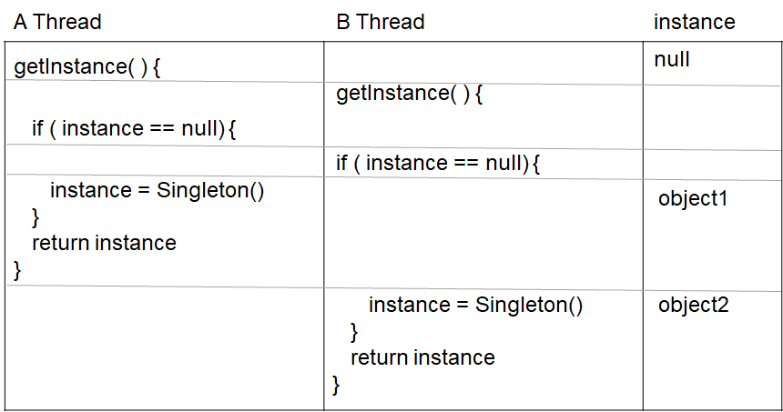

# 5장

## 싱글톤

싱글톤 패턴은 해당 클래스의 인스턴스가 하나만 만들어지고 어디서든지 그 인스턴스에 접근할 수 있도록 하기 위한 패턴

## 고전적인 싱글톤

```kotlin
class Singleton private constructor() {
    companion object {
        private var instance: Singleton? = null
        fun getInstance(): Singleton =
            instance ?: Singleton().also {
                instance = it
            }
    }
}
```

### 초콜릿 공장

```kotlin
class ChocolateBoiler  private constructor() {
    var isEmpty = true
        private set

    var isBoiled = false
        private set

    fun fill() {
        if (isEmpty) {
            isEmpty = false
            isBoiled = false
        }
    }

    fun drain() {
        if (!isEmpty && isBoiled) {
            isEmpty = true
        }
    }

    fun boil() {
        if (!isEmpty && !isBoiled) {
            isBoiled = true
        }
    }

    companion object {
        private var instance: ChocolateBoiler ? = null
        fun getInstance(): ChocolateBoiler  =
            instance ?: ChocolateBoiler().also {
                instance = it
            }
    }
}
```

### 문제점

```kotlin
getInstance(){
	if(instance==null) {
		instance = Singleton()
	}
	return instance
}
```



멀티 스레딩 환경에서 instance가 null체크를 한 후 인스턴스가 생성되기 전에 다른 스레드에서 nul체크를 할 경우 서로 다른 인스턴스가 생성될 수 있다.

## 해결

### 1. Synchronized

```kotlin
companion object {
        private var instance: Singleton? = null
        @Synchronized fun getInstance(): Singleton =
            instance ?: Singleton().also {
                instance = it
            }
    }
```

getInstance 메소드에 Synchronized를 추가하면 한 스레드가 해당 메소드를 사용을 끝내기 전까지 다른 스레드는 잠시 기다린다

문제점 : 사실 동기화가 필요한 부분은 instance가 null인지 체크하는 부분이지만 메소드 전체를 동기화하여 불필요한 오버해드가 발생한다.

속도가 그리 중요하지 않다면 수정하지 않아도 괜찮음

### 2. 인스턴스를 필요할 때 생성하지 말고, 처음부터 만들어 버립니다.

```kotlin
companion object {
        private var instance: ChocolateBoiler = ChocolateBoiler()
        fun getInstance() = instance
}
```

에플리케이션에서 반드시 Singleton의 인스턴스를 생성하고 그 인스턴스를 사용한다면 또는 수시로 만들고 관리하기가 성가시다면 다음과 같은 식으로 처음부터 Singleton 인스턴스를 만들어 버르는것도 괜찮은 방법

### 3. DCL(Double Checking Locking)

```kotlin
companion object {
        @Volatile
        private var instance: Singleton? = null
        fun getInstance(): Singleton =
            instance ?: synchronized(this) {
                instance ?: Singleton().also {
                    instance = it
                }
            }
    }
```

DCL은 인스턴스가 생성되어 있을경우 인스턴스를 반환하며 생성되지 않았을 경우에만 동기화 구문을 실행합니다.

### volatile

변수를 사용하고 있지 않는 멀티 스레드 어플리케이션에서는 작업(Task)을 수행하는 동안 성능 향상을 위해 Main Memory 에서 읽은 변수 값을 CPU Cache 에 저장하게 됩니다. 만약에 멀티 스레드 환경에서 스레드가 변수 값을 읽어올 때 각각의 CPU Cache 에 저장된 값이 다르기 때문에 변수 값 불일치 문제가 발생하게 되는데, volatile 키워드가 이런 문제를 해결해 줍니다.