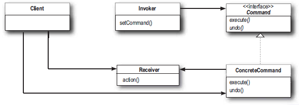

# 6장

## 커멘드 패턴

요청을 객체의 형태로 캡슐화하여 요청과 해당 요청 수행을 분리하는 디자인 패턴

- 커맨드 패턴을 이용하면 요구 사항을 객체로 캡슐화 할 수 있다
- 매개변수를 써서 여러가지 다른 요구 사항을 집어넣을 수도 있다
- 요청사항을 큐에 저장하거나 로그로 기록할수도 있으며 작업을 취소하는 기능도 지원한다

## 첫 번째 커맨드 객체

불은 On/Off 할 수 있는 리모컨을 만들어봅시다.

```kotlin
interface Command {
    fun execute()
}

//전등을 켜기 위한 커맨드 클래스 구현
class LightOnCommand(private val light: Light) : Command {
    override fun execute() {
        light.on()
    }
}

class SimpleRemoteControl() {
    lateinit var slot: Command

    fun setCommand(command: Command) {
        slot = command
    }

    fun buttonWasPressed() {
        slot.execute()
    }
}
```

```kotlin
fun main() {
    val remote = SimpleRemoteControl()
    val light = Light()
    val lightOnCommand = LightOnCommand(light)

    remote.setCommand(lightOnCommand)
    remote.buttonWasPressed()
}
```



**Client :** main()

- ConcreteCommand를 생성하고 Receiver를 설정합니다.

**Invoker :** SimpleRemoteControl

- 인보커에는 명령이 들어 있으면 execute() 메소드를 호출함으로써 커맨드 객체에게 특정 작업을 수행해 달라는 요구를 하게 됩니다.

**Receiver :** Light

- 리시버는 요구 수항을 수행하기 위해 어떤 일을 처리해야 하는지 알고 있는 객체입니다

**ConcreteCommand :** LightOnCommand

- 특정 행동과 리시버를 연결해줍니다
- 인보커에서 execute() 호출을 통해 요청을 하면 ConcreteCommand 객체에서 리시버에 있는 메소드를 호출합니다.

**Command :** Command 

- 모든 커맨드 객체에서 구현해야 하는 인터페이스입니다.
- 리시버에 특정 작업을 처리하라는 지시를 전달합니다.

## 리모컨에 여러 기능 추가하기

본격적으로 여러 기능이 있는 리모컨을 만듭니다.

```kotlin
class RemoteControl {
    private val onCommands: Array<Command> = Array(7) { NoCommand() }
    private val offCommands: Array<Command> = Array(7) { NoCommand() }

    fun setCommand(slot: Int, onCommand: Command, offCommand: Command) {
        this.onCommands[slot] = onCommand
        this.offCommands[slot] = offCommand
    }

    fun onButtonWasPushed(slot: Int){
        onCommands[slot].execute()
    }

    fun offButtonWasPushed(slot: Int){
        offCommands[slot].execute()
    }
}
```

- 총 7개의 on off 기능이 있는 RemoteControl class를 생성합니다.
- 버튼이 할당되지 않았을때 null체크를 하는 번거로움을 줄이기 위하여 아무 동작도 하지 않는 NoCommand 라는 객체도 추가합니다.

### 커맨드 클래스

```kotlin
interface Command {
    fun execute()
}

class NoCommand() : Command {
    override fun execute() {}
}

class LightOnCommand(private val light: Light) : Command {
    override fun execute() = light.on()
}

class LightOffCommand(private val light: Light) : Command {
    override fun execute() = light.off()
}

class StereoOnWithCdCommand(private val stereo: Stereo) : Command {
    override fun execute() {
        stereo.on()
        stereo.setCD()
        stereo.setVolume()
    }
}
```

```kotlin
fun main() {
    val remote = RemoteControl()
    val light = Light()
    val lightOnCommand = LightOnCommand(light)
    val lightOffCommand = LightOffCommand(light)

    val stereo = Stereo()
    val stereoOnCommand = StereoOnWithCdCommand(stereo)
    val stereoOffCommand = StereoOffCommand(stereo)
    remote.setCommand(0, lightOnCommand, lightOffCommand)
    remote.setCommand(1, stereoOnCommand, stereoOffCommand)

    remote.onButtonWasPushed(0)
    remote.offButtonWasPushed(0)
    remote.onButtonWasPushed(1)
    remote.offButtonWasPushed(1)
}
```

```
light On
light Off
stereo On
stereo Set CD
stereo set Volume
stereo Off
```

커맨드를 생성하고 setCommand() 메소드를 통해 임의의 버튼에 on off 커맨드를 할당합니다.

Stereo On같이 복잡한 과정을 거치는 동작도 Client 입장에서는 Remote 객체에 커맨드를 할당할 뿐 해당 커맨드가 어떤 동작을 하는지는 전혀 알 필요가 없습니다.

### UNDO 기능 추가

```kotlin
interface Command {
    fun execute()
    fun undo()
}

class LightOnCommand(private val light: Light) : Command {
    override fun execute() = light.on()
    override fun undo() = light.off()
}

class LightOffCommand(private val light: Light) : Command {
    override fun execute() = light.off()
    override fun undo() = light.on()
}
```

Command 에 undo 메소드를 추가합니다.

undo 버튼이 눌렸을때 필요한 작업을 처리하기 위한 코드를 추가합니다.

LightOnCommand의 경우 이전상태는 off이므로 undo 메소드에서 light를 off합니다.

```kotlin
class RemoteControl {
    private val onCommands: Array<Command> = Array(7) { NoCommand() }
    private val offCommands: Array<Command> = Array(7) { NoCommand() }
    private val undoCommand: Command = NoCommand()

    fun setCommand(slot: Int, onCommand: Command, offCommand: Command) {
        this.onCommands[slot] = onCommand
        this.offCommands[slot] = offCommand
    }

    fun onButtonWasPushed(slot: Int){
        onCommands[slot].execute()
        undoCommand = onCommands[slot]
    }

    fun offButtonWasPushed(slot: Int){
        offCommands[slot].execute()
        undoCommand = onCommands[slot]
    }

		fun undoButtonWasPushed(){
				undoCommand.undo()
		}
}
```

undoCommand 필드를 추가하여 마지막으로 실행한 커맨드를 저장합니다.

undo 버튼을 누르면 마지막으로 실행한 커맨드의 undo 메소드를 실행합니다.

### 매크로 커맨드 사용 방법

```jsx
class MacroCommand(private val commands: Array<Command>) : Command{
    override fun execute() {
				commands.foreach{ command ->
						command.execute()
				}
		}
}

...

val partyOn = arrayOf(lightOn, stereoOn, tvOn, hottubOn)
val partyOff = arrayOf(lightOff, stereoOff, tvOff, hottubOff)
val partyOnMacro = MacroCommand(partyOn)
val partyOffMacro = MacroCommand(partyOff)

remoteControl.setCommand(0,partyOnMacro,partyOffMacro)
```

다른 종류의 커맨드를 한번에 실행시킬수 있는 새로운 종류의 커맨드를 만들어 사용 할 수 있습니다.

- 우선 커맨드에 집어넣을 일련의 커맨드들을 생성합니다.
- ON 커맨드와 OFF 커맨드를 위한 배열을 하나씩 만들고 필요한 커맨드를 집어넣습니다.
- MacroCommand 객체에 버튼을 할당합니다.

### 요청을 큐에 저장하기

- 커멘드 인터페이스를 구현하는 객체를 큐에 추가합니다
- 스레드에서는 큐로부터 커맨드를 하나씩 가져와 excute() 메소드를 호출합니다.
- 실행이 끝나면 다시 큐에서 새로운 커맨드를 가져와 반복합니다.

### 요청을 로그에 기록하기

어떤 에플리케이션에서 요청을 기록해놨다가 그 에플리케이션이 다운되었을 경우 나중에 그 행동을 다시 호출해서 복구할 수 있도록 해야합니다. 이때 커맨드 패턴을 사용하면 store()와 load()라는 메소드를 추가하여 이런 기능을 지원할 수 있습니다.

- 각 커맨드가 실행될 때 마다 디스크에 그 내역을 저장합니다 store()
- 시스템이 다운된 후에 객체를 다시 로딩하고 순서대로 작업을 다시 처리합니다. load()

### 핵심정리

- 커맨드 패턴을 이용하면 요청을 하는 객체와 그 요청을 수행하는 객체를 분리시킬 수 있습니다.
- 이렇게 분리시키는 과정의 중심에는 커맨드 객체가 있으며, 이 객체가 행동이 들어있는 리시버를 캡슐화합니다.
- 인보커에서는 요청 할 때는 커맨드 객체의 execute()메소드를 호출하면 됩니다. execute() 메소드에서는 리시버에 있는 행동을 호출합니다.
- 인보커는 커맨드를 통해서 매개변수화 될 수 있습니다. 이런 실행중에 동적으로 설정할 수도 있습니다.
- execute() 메소드가 마지막으로 호출되기 전의 기존 상태로 되돌리기 위한 작업취소 메소드를 구현하면 커맨드 패턴을 통해서 작업취소 기능을 지원 할 수도 있습니다.
- 매크로 커맨드는 커맨드를 한꺼번에 호출할 수 있게 해주는 간단한 방법입니다. 매크로 커맨드에서도 어렵지 않게 작업취소 기능을 지원할 수 있습니다.
- 프로그래밍을 하다 보면 요청 자체를 리시버한태 넘기지 않고 자기가 처리하는 스마트 커맨드 객체를 사용하는 경우도 종종 있습니다. (?)
- 커맨드 패턴을 활용하여 로그 및 트랜잭션 시스템을 구현하는 것도 가능합니다.