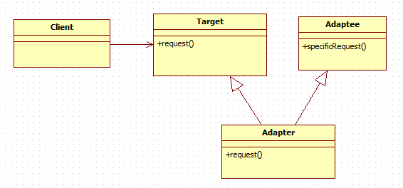
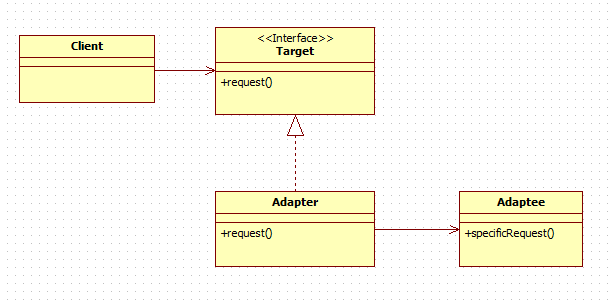
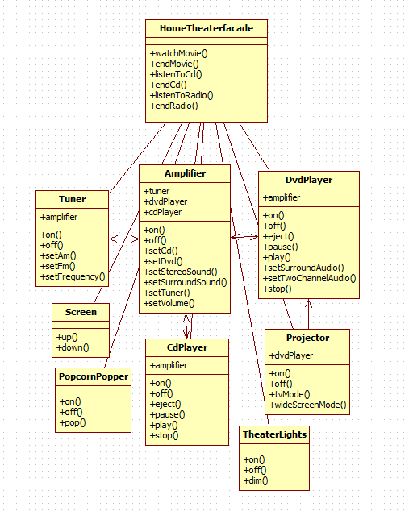

# 7장

## 어댑터 패턴

한 클래스의 인터페이스를 클라이언트에서 사용하고자 하는 다른 인터페이스로 변환합니다. 어뎁터를 이용하면 인터페이스 호환성 문제 때문에 같이 쓸 수 없는 클래스들을 연결해서 쓸 수 있습니다.

### 클라이언트에서 어댑터를 사용하는 방법

- 클라이언트에서 타겟 인터페이스를 사용하여 메소드를 호출함으로써 어댑터에 요청을 합니다.
- 어댑터에서는 어댑터 인터페이스를 사용하여 그 요청을 어댑터에 대한 (하나 이상의) 메소드 호출로 변환합니다.
- 클라이언트에서는 호출 결과를 받긴 하지만 중간에 어댑터가 껴 있는지는 전혀 알지 못합니다.

```kotlin
interface Duck {
    fun quack()
    fun fly()
}

class MallardDuck : Duck {
    override fun quack() = println("Quack")
    override fun fly() = println("I`m flying")
}

interface Turkey {
    fun gobble()
    fun fly()
}

class WildTurkey : Turkey {
    override fun gobble() = println("Gobble gobble")
    override fun fly() = println("I`m flying a short distance")
}

class TurkeyAdapter(private val turkey: Turkey) : Duck {
    override fun quack() = turkey.gobble()

    override fun fly() {
        for (i in 1..5) {
            turkey.fly()
        }
    }
}
```

```kotlin
fun main(){
    val duck = MallardDuck()
    val turkey = WildTurkey()

    val turkeyAdapter = TurkeyAdapter(turkey)

    println("The Turkey says")
    turkey.gobble()
    turkey.fly()

    println("\nThe Duck says")
    duck.quack()
    duck.fly()

    println("\nThe turkeyAdapter says")
    turkeyAdapter.quack()
    turkeyAdapter.fly()
}
```

```
[실행결과]
The Turkey says
Gobble gobble
I`m flying a short distance

The Duck says
Quack
I`m flying

The turkeyAdapter says
Gobble gobble
I`m flying a short distance
I`m flying a short distance
I`m flying a short distance
I`m flying a short distance
I`m flying a short distance
```

### 클래스 어댑터

* 클래스 어댑터에서는 다중 상속을 이용하기 때문에 자바에서는 쓸 수 없습니다



client : 클라이언트에서는 오리하태 얘기하고 있다고 생각합니다.

Target : Duck 클래스 입니다.

Adapter : Adapter는 Duck와 Turkey를 모두 확장한 클래스 이므로 두 클래스의 요청에 모두 반응 할 수 있습니다.

Adaptee : Turkey의 메서드는 Duck와 다르지만 어댑터를 통해서 Duck에 대한 메소드 호출을 가로채서 Turkey의 메소드를 호출로 변환해 줍니다.

### 객체 어댑터



client : 클라이언트에서는 오리하태 얘기하고 있다고 생각합니다.

Target : 클라이언트에서는 이 클래스의 메소드를 호출합니다.

Adapter : 어댑터에서는  Duck 인터페이스를 구현하지만 메소드가 호출되었을 때 그 호출을 Turkey 메소드 호출로 변환해 줍니다.

Adaptee : 어댑터 덕분에 클라이언트에서 Duck 인터페이스에 대해 호출한 것을 Turkey에서도 받아서 처리할 수 있습니다.

### 핵심 정리

- 기존 클래스를 구현하려고 하는데 인터페이스가 맞지 않을때 어댑터 패턴을 사용합니다.
- 어댑터는 인터페이스를 클라이언트에서 원하는 인터페이스로 바꿔주는 역할을 합니다.
- 어댑터를 구현할 때는 타겟 인터페이스의 크기와 구조에 따라 코딩해야할 분량이 결정됩니다.
- 어댑터 패턴에는 객체 어댑터 패턴과 클래스 어댑터 패턴이 있습니다. 클래스 어댑터를 쓰려면 다중 상속 기능이 필요합니다.
- 어댑터는 객체를 감싸서 인터페이스를 바꾸기 위한 용도로 사용합니다.

## 퍼사드 패턴

어떤 서브시스템의 일련의 인터페이스에 대한 통합된 인터페이스를 제공합니다. 퍼사드에서 고수준 인터페이스를 정의하기 때문에 서브스스템을 더 쉽게 사용할 수 있습니다.



```kotlin
fun watchMovie(movie:String){
    println("Get ready to watch a movie")
    popper.on()
    popper.pop()
    lights.dim(10)
    screen.down()
    projector.on()
    projector.wideScreenMode()
    amp.on()
    amp.setDvd(dvd)
    amp.setSurroundSound()
    amp.setVolume(5)
    dvd.on()
    dvd.play(movie)
}
```

watchMovie 메소드 구현 예시

### 최소 지식 원칙

어떤 객체든 그 객체와 상호작용을 하는지에도 주의를 기울여야 한다는 디자인 원칙

여러 클래스들이 복잡하게 얽혀서 시스템의 한 부분을 변경했을 때 다른 부붑ㄴ까지 줄줄이 고쳐야 되는 상황을 미리 방지할 수 있습니다.

<최소 지식 원칙>을 지키기위한 네 종류의 가이드라인은 다음과 같습니다.

- 객체 자체
- 메소드에 매개변수로 전달된 객체
- 그 메소드에서 생성하거나 인스턴스를 만든 객체
- 그 객체에 속하는 구성요소

### 핵심 정리

- 큰 인터페이스 또는 여러 인터페이스를 단수화시키거나 통합 시켜야 되는 경우에는 퍼사드를 사용합니다.
- 퍼사드는 클라이언트를 복잡한 서브시스템과 분리시켜주는 역할을 합니다.
- 퍼사드 패턴에서는 서브시스템을 가지고 퍼사드를 만들고 실제 작업은 서브클래스에 맡깁니다.
- 한 서브시스템에 퍼사드를 여러개 만들어도 됩니다.
- 퍼사드는 일련의 객체들을 감싸서 단순화시키기 위한 용도로 쓰입니다.