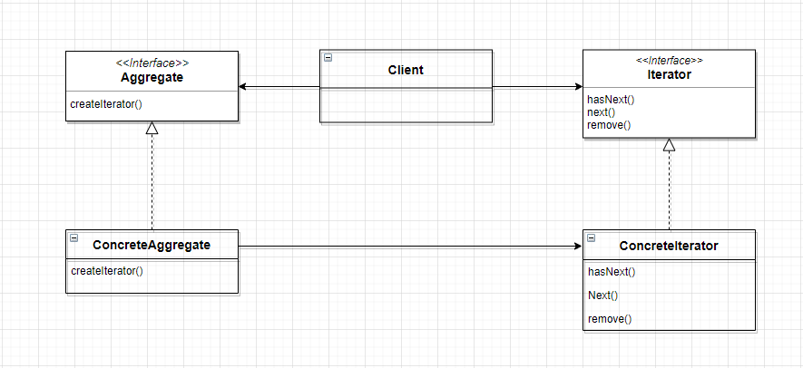

# 9장

### 메뉴 구현 방식이 다르면 무슨 문제가 생길까요?

→ printMenu() 메소드를 구현할때

```kotlin
ArrayList breakfastItems = pancakeHouseMenu.getMenuItems()
MenuItem[] lunshItems = dinerMenu.getMenuItems()
```

pancakeHouseMenu와 dinerMenu의 메소드 이름은 똑같지만 반환 형식이 다릅니다.

- pancakeHouseMenu의 항목을 출력하기 위해서는 arrayList에 대한 순환문을 돌립니다.
- dinerMenu의 항목을 출력할 때는 배열에 대한 순환문을 돌립니다.

각 아이템에 대한 반복적인 작업을 수행할기위해서 두개의 순환문을 사용해야 합니다.

만약 다른 구현법을 사용하는 레스토랑이 또 합병되면 순환문이 세 개가 필요하게 됩니다.

### 반복을 캡슐화

- breakfastItems의 각 항목에 대해서 순환물을 돌릴 때는 ArrayList의 size()와 get()메소드를 사용합니다.
- lunshItems에 대해서 순환문을 돌릴 때는 배열의 length 필드와 배열 첨자를 이용합니다.
- 객체의 컬랙션에 대한 반복작업을 처리하는 방법을 캡슐화한 Iterator라는 객체에 전달합니다.

# 이터레이터 패턴

컬랙션 구현 방법을 노출시키지 않으면서도 그 집합체 안에 들어있는 모든 항목에 접근할 수 있게 해 주는 방법을 제공해 줍니다.



**Iterator**

- 모든 반복자에서 구현돼야 하는 인터페이스를 제공하며 컬랙션에 들어있는 원소들에 돌아가면서 접근할 수 있게 해주는 메소드들을 제공합니다.

**ConcreteIterator**

- 반복잡업중 현재 위치를 관리하는 일을 맡고 있습니다.

**ConcreteAggregate**

- 객체 컬렉션이 들어 있으며 그 안에 들어있는 컬렉션에 대한 Iterator를 리턴하는 메소드를 구현합니다.
- 모든 ConcreteAggregate는 그안에 컬렉션에 대해 돌아가면서 반복 작업을 처리 할 수 있게 해주는 ConcreteIterator 인스턴스를 만들 수 있어야 합니다.

**Aggregate**

- 공통 인터페이스

## 컴포지트 패턴

객체들을 트리 구조로 구성하옆부분과 전체를 나타내는 계층구조로 만들수 있습니다.

클라이언트에서 개별객체와 다른 객체들로 구성된 복핮객체를 똑같은 방법으로 다룰 수 있습니다.


**Component**

- Leaf 클래스와 Composite 클래스에 공통 인터페이스를 정의합니다

**Leaf**

- 단일객체로 composite의 부분 객체로 들어가게 됩니다

**Composite**

- 집합 객체로 Leaf 객체나 Composite 를 부분 객체로 둡니다.
- 클라이언트는 composite를 통해 부분 객체들을 사용할 수 있습니다

## 핵심정리

### 이터레이터 패턴

- 이터레이터를 이용하면 내부 구조를 드러내지 않으면서도 컬렉션 내부에 있는 모든 요소들에 접근이 가능 할 수 있습니다
- 이터래이터 패턴을 이용하면 집합체에 대한 반복작업을 별도에 객체로 캡슐화 할 수 있습니다
- 이터레이터 패턴을 이용하면 컬랙션에 있는 머든 데이터에 대하여 반복작업 하는 역할을 컬렉션에서 분리 시킬 수 있습니다.
- 이터래이터 패턴을 쓰면 다양한 집합체에 들어있는 객체에 대한 반복작업들에 대한 똑같은 인터페이스를 적용할 수 있기 때문에 집합체에 있는 객체를 활용하여 코드를 만들때 다형성을 활용할 수 있습니다
- 한 클래스에는 되도록 한 역할만 부여하는것이 좋습니다.

### 컴포지트 패턴

- 컴포지트 패턴에서는 개별객체와 복합객체를 모두 담아둘 수 있는 구조를 제공합니다
- 컴포지트 패턴을 이용하면 클라이언트에서 개별 객체와 복합 객체를 똑같은 방법으로 다룰 수 있습니다
- 복합구조에 들어있는 것을 구성요소라 부릅니다. 구성요소에는 복합객체와 앞 노드가 있습니다.
- 컴포지트 패턴을 적용할 때는 여러가지 장단점을 고려해야 합니다. 상황에 따라 튜명성과 안정성 사이에서 적절한 평형점을 찾아야 합니다