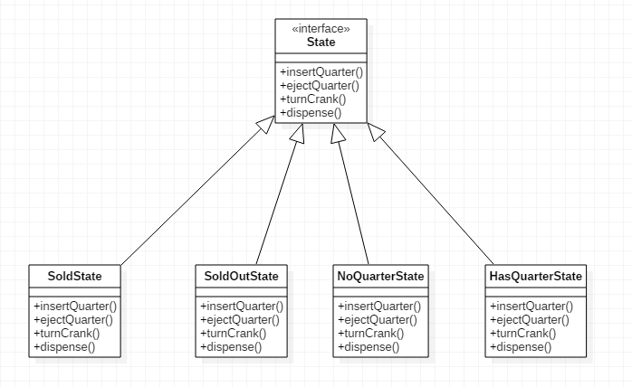

# 10장

## 스테이트 패턴

객체의 내부 상태가 바뀜에 따라서 객체의 행동이 바뀝니다 마치 객체의 클래스가 바뀐 것과 같은 결과를 만들어줍니다.

- 모든 상태 변화를 IF문을 사용하지 않고 구분합니다
- 한 상태에 대한 코드를 수정할 때 다른 코드까지 수정해야 하는 일이 발생하지 않습니다

### 뽑기 기계의 State 인터페이스 및 클래스



```kotlin
interface State {
    fun insertQuarter()
    fun ejectQuarter()
    fun turnCrank()
    fun dispense()
}

class SoldState : State {
    override fun insertQuarter() = println("잠시만 기다려주세요 ~~~")
    override fun ejectQuarter() = println("이미 알맹이를 뽑으셨습니다.")
    override fun turnCrank() = println("손잡이를 한번만 돌려주세요")
    override fun dispense() {
        gumballMachine.releaseBall()
        if (gumballMachine.count > 0) {
            gumballMachine.setState(gumballMechine.getNoQuarterState())
        } else {
            println("Oops, out of gumballs!")
            gumballMachine.setState(gumballMachine.getSoldOutState())
        }
    }
}

...
```

State<interface>는 모든 상태 클래스에서 사용할 인터페이스 뽑기 기계에서 일어날 수 있는 모든 행동들에 직접적으로 대응됩니다. 모든 상태는 State를 구현하여 만듭니다.


**Context**

- context는 State를 통해 ConcreteState에서 구현된 행동을 실행할 수 있다.
- request()가 호출되면 상태 객체에거 그 작업을 위임합니다

**state.handle()**

- context객체에 request 메소드가 호출되면 작ㅇ업은 상태 객체에게 맡겨집니다.

**State**

- 모든 구성 상태 클래스에대한 공통 인터페이스

**ConcreteStateA /B**

- State를 구현하여 자신의 상태에 맞게 행동을 설계합니다
- context로 부터 받은 요청을 처리합니다.

## 스트레티지 패턴 vs 스테이트 패턴

- 스트래티지 패턴과 같은 다이어그램을 가지고 있지만 두 패턴의 용도에서 차이가 납니다
- 스테이트 패턴에서는 클라이언트는 상태 객체에 대해서 알 필요 없고 Context만 알면 됩니다.
- 스트래티지 패턴은 객체를 유연하게 바꾸는 게 목적이므로 어떠한 객체들을 직접 지정해서 사용하므로 각 세부 객체들을 알고 있어야 합니다

## 핵심정리

스테이트 패턴을 이용하면 내부 상태를 바탕으로 여러 가지 서로 다른 행동을 사용할 수 있습니다.

프로시저형 상태 기계를 쓸 때와는 달리 각 상태를 클래스를 이용하여 표현합니다.

Context 객체에서는 현재 상태에게 행동을 위임합니다.

각 상태를 클래스로 캡슐화함으로써 나중에 변경시켜야 하는 내용을 국지화시킬 수 있습니다.

스테이트 패턴과 스트레티지 패턴의 클래스 다이어그램은 똑같지만 그 용도는 서로 다릅니다

스트레티지 패턴에서는 일반적으로 행동 또는 알고리즘으류context 클래스를 만들 때 설정합니다.

스테이트 패턴을 이용하면 Context 내부 상태가 바뀜에 따라 알아서 행동을 바꿀 수 있도록 할 수 있습니다.

상태 전환은 State 클래스에 의해서 제어할 수도 있고 Context 클래스에 의해서 제거할 수도 있슴니다

스테이트 패턴을 이용하면 보통 디자인에 필요한 클래스의 개수가 늘어납니다

State 클래스를 여러 Context객체의 인스턴스에서 공유하도록 디자인할 수도 있습니다.