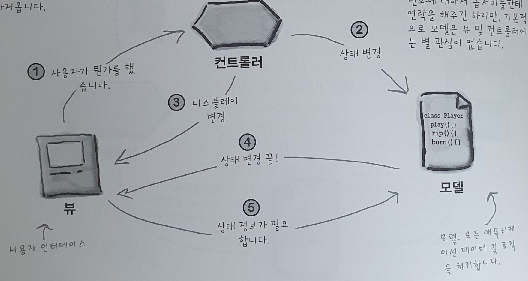

# 12장

## 컴파운드 패턴

두 개 이상의 패턴을 결합하여 일반적으로 자주 등장하는 문제들에 대한 해법을 제공하는 패턴

## MVC 집중 탐구

**Model**

모델에서는 모든 데이터,상태 및 어플리케이션 로직이 들어있습니다. 뷰와 컨트롤러에서 모델의 상태를 조작하거나 가져오기 위한 인터페이스를 제공하고 모델에서 자신의 상태 변화에 대해서 옵저버들한태 연락을 해주긴 하지만 기본적으로 모델은 뷰 및 컨트롤러에 별 관심이 없습니다. 

**View**

모델을 표현하는 방법을 제공합니다. 일반적으로 화면에 표시하기 위해 필요한 상태 및 데이터는 모델에서 직접 가져옵니다.

**Controller**

사용자로부터 데이터를 받아서 그것이 모델에게 어떤 의미가 있는지 파악합니다.

1. 사용자는 View 하고만 접촉할 수 있습니다.
2. Controller에서 Model한태 상태를 변경하라는 요청을 합니다.
3. Controller에서 View를 변경해달라고 요청할 수 있습니다.
4. 상태가 변경되면 Model에서 View한태 그 사실을 알립니다.
5. View에서 Model한태 상태를 요청합니다.

## MVC에서 쓰이는 패턴

**Controller - Strategy Pattern**

- View에서는 어플리케이션의 겉모습에만 신경을 쓰고 인터페이스의 행동에 대한 결정은 모두 컨트롤러 한태 맡깁니다.
- 스트래티지 패턴을 사용하는 것은 뷰를 모델로부터 분리시키는 데에도 도움이 됩니다.

**View - Composite Pattern**

- 디스플레이는 여러 윈도우, 패널, 버튼, 텍스트, 레이블 등으로 구성됩니다.
- 컴포지트 패턴을 사용하면 컨트롤러에서 뷰한태 화면을 갱신해 달라고 요청하면 컴포지트 패턴을 통해 처리됩니다.

**Model - Observer Pattern**

- 옵저버 패턴을 사용하면 상태가 변경되었으 때 그 Model하고 연관된 객체들한태 알립니다.
- 옵저버 패턴을 사용하면 View 및 Controller로부터 완전히 독립시킬 수 있습니다.
- 한 모델에서는 서로 다른 뷰를 동시에 사용하는 것도 가능합니다.

## 핵심 정리

- MVC패턴은 옵저버 패턴, 스트래티지 패턴, 컴포지트 패턴으로 이루어진 컴파운드 패턴입니다.
- Model에서는 옵저버 패턴을 이용하여 옵저버들에 대한 의존성을 없애면서도 옵저버들한태 자신의 상태가 변경되었음을 알릴 수 있습니다.
- Controller는 View에 대한 전략 객체입니다. View에서는 Controller를 바꾸기만 하면 다른 행동을 활용할 수 있습니다.
- Model과 VIew, Controller는 이 세 패턴을 통해서 서로 연결됩니다. 상대방에 대해 느슨하게 결합되기 때문에 깔끔하면서도 유연하게 구현할 수 있습니다.
- 새로운 Model을 기존의 View 및 Controller하고 연결해서 쓸 때는 어댑터 패턴을 활용하면 됩니다.